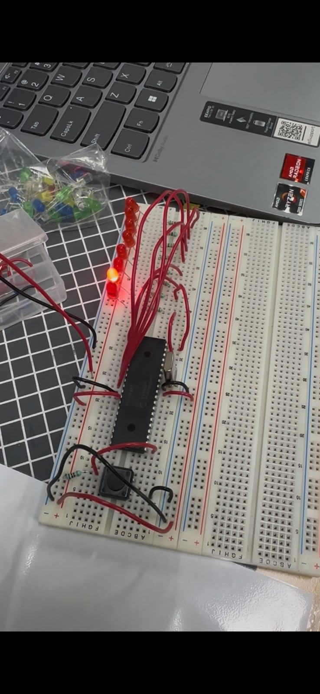
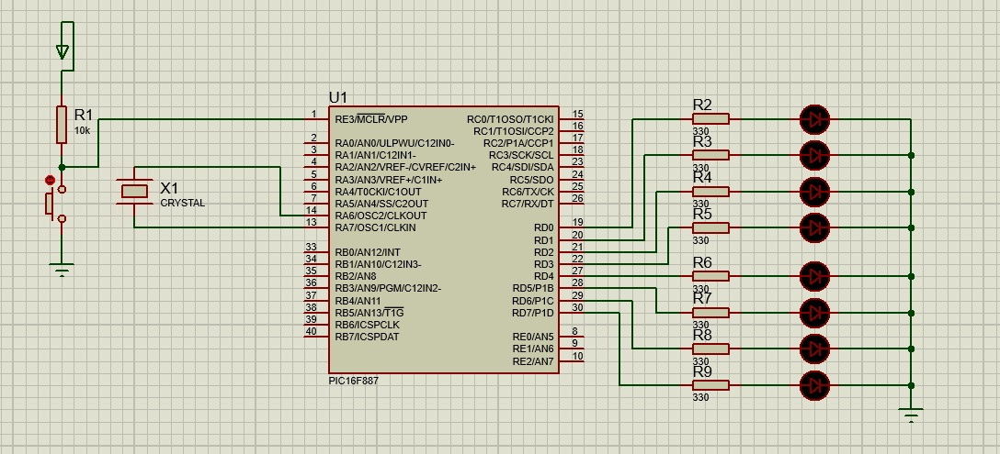

# Práctica 01 - Salidas Digitales 

## Material utilizado

- PIC16F887
- Protoboard
- LEDs
- Resistencias de 330 Ω
- Fuente de alimentación
- Programador PIC
- Cristal de Cuarzo de 8 MHz
- Resistencia de 1 kΩ
- Botón
---

## Circuito 

A continuación se muestra el circuito implementado en protoboard y su simulación en Proteus.

 

 

*Figura 1. Circuito armado en protoboard.*

  

 

*Figura 2. Simulación del circuito en Proteus.*

 

---

## Desarrollo

### Manejo de salidas digitales

Para esta práctica se utilizaron las salidas digitales del PIC16F887 con el objetivo de controlar el encendido y apagado de LEDs conectados a los puertos de salida del microcontrolador. Mediante la programación de diferentes patrones binarios fue posible generar secuencias visuales que permitieron comprender el funcionamiento básico de las salidas digitales y su aplicación en el control de dispositivos externos.

La práctica se dividió en tres partes con el objetivo de comprender el manejo de salidas digitales, la representación binaria mediante LEDs y la generación de secuencias visuales utilizando el microcontrolador PIC16F887.

### Parte 1: Encendido y apagado de LEDs

En la primera parte se programó el microcontrolador para mantener encendidos cuatro LEDs durante un intervalo de tiempo determinado y posteriormente apagarlos de manera simultánea. Esta secuencia se ejecutó de forma continua dentro de un ciclo repetitivo, generando un patrón periódico de encendido y apagado.

Esta actividad permitió comprender la configuración básica de los puertos digitales como salidas y el control simultáneo de múltiples LEDs mediante programación.

### Parte 2: Contador hexadecimal

En la segunda parte se implementó un contador hexadecimal utilizando los LEDs como indicadores visuales. Los estados de encendido y apagado representaban los valores binarios correspondientes a cada número hexadecimal.

La secuencia avanzaba de manera ascendente mostrando los diferentes estados binarios y permitiendo observar visualmente la correspondencia entre los números hexadecimales y su representación en binario mediante LEDs.

### Parte 3: Caminata de LEDs

En la tercera parte se desarrolló una secuencia de desplazamiento utilizando ocho LEDs, donde cada LED se encendía de forma consecutiva mientras los demás permanecían apagados. Este efecto, conocido como "caminata de LEDs", generó un patrón visual de movimiento a lo largo de la hilera de LEDs.

La secuencia se repitió continuamente durante la ejecución del programa, permitiendo comprender el control individual de cada salida digital y la creación de patrones secuenciales mediante programación.

Mediante esta práctica se reforzaron conceptos relacionados con el manejo de salidas digitales, configuración de puertos, representación binaria de datos, temporización y generación de secuencias visuales utilizando el microcontrolador PIC16F887.

---

## Archivos de programación

### Parte 1 - Encendido y apagado de LEDs

📄 Archivo HEX utilizado para el encendido y apagado de 4 LEDs:

- [Practica1_Encendido.production.hex](Practica1.X.production.hex)

### Parte 2 - Contador hexadecimal

📄 Archivo HEX utilizado para el contador hexadecimal:

- [Practica1_Hexadecimal.production.hex](Practica1.X.production.hex)

### Parte 3 - Caminata de LEDs

📄 Archivo HEX utilizado para la caminata de LEDs:

- [Practica1_Caminata.production.hex](Practica_1_Caminata.X.production.hex)

---

## Resultados

Se logró controlar correctamente los LEDs mediante las salidas digitales del PIC16F887, implementando patrones de encendido y apagado, un contador hexadecimal y una caminata secuencial de LEDs. En todos los casos se verificó el correcto funcionamiento de las salidas digitales y de las secuencias programadas.

---

## Conclusiones

La práctica permitió comprender el funcionamiento de las salidas digitales del PIC16F887 y su aplicación en el control de LEDs. Además, se reforzaron conocimientos relacionados con la configuración de puertos, representación binaria de datos, temporización y generación de secuencias visuales mediante programación.
