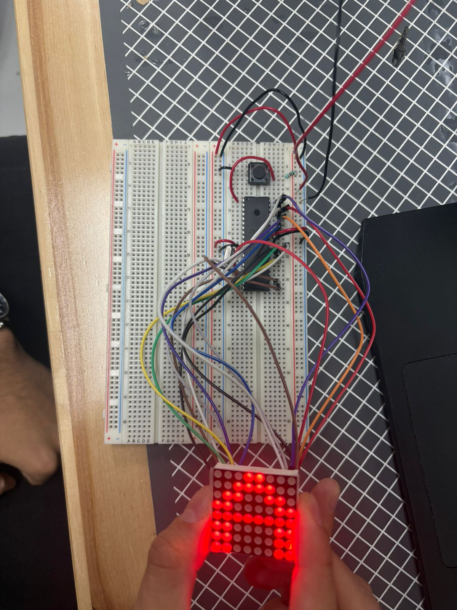

# Práctica 02 - Matriz LED 8x8

## Objetivo

Programar una matriz LED de 8x8 utilizando el microcontrolador PIC16F887 para desplegar diferentes patrones visuales mediante el control de filas y columnas.

---

## Material utilizado

- PIC16F887
- Matriz LED 8x8
- Protoboard
- Resistencias
- Fuente de alimentación
- Programador PIC
- Cables de conexión

---

## Circuito armado

A continuación se muestra el circuito implementado en protoboard y su simulación en Proteus.

 

 

*Figura 1. Circuito armado en protoboard.*

  

!(proteus_p02.jpg)

 

*Figura 2. Simulación del circuito en Proteus.*

 

---

## Desarrollo

La práctica se dividió en dos partes con el objetivo de comprender el funcionamiento de una matriz LED de 8x8 y la técnica de multiplexación necesaria para controlar cada uno de sus LEDs.

### Parte 1: Despliegue de una "X"

En la primera parte se programó la matriz LED para mostrar una figura con forma de "X". Para lograrlo, se definió un patrón específico de encendido y apagado de LEDs, activando únicamente aquellos correspondientes a las diagonales de la matriz. Esta actividad permitió comprender la distribución física de filas y columnas y la manera en que cada LED puede controlarse individualmente mediante programación.

### Parte 2: Despliegue de iniciales

En la segunda parte se desarrollaron patrones personalizados para representar las primeras dos iniciales de los integrantes del equipo: **D, A, L y M**. Cada letra fue diseñada mediante una configuración específica de LEDs encendidos dentro de la matriz, logrando visualizar caracteres reconocibles mediante el proceso de multiplexación.

Mediante esta práctica se reforzaron conceptos relacionados con el manejo de matrices LED, control de puertos digitales, multiplexación y diseño de patrones visuales utilizando el microcontrolador PIC16F887.

---

## Archivos de programación

### Parte 1 - Patrón "X"

📄 Archivo HEX utilizado para desplegar la letra X en la matriz LED:

- [Practica_2_x_.X.production.hex](Practica_2_x_.X.production.hex)

### Parte 2 - Iniciales

📄 Archivo HEX utilizado para desplegar las iniciales del equipo:

- [Practica_2_Letras_.X.production.hex](Practica_2_Letras_.X.production.hex)

---

## Resultados

Se logró visualizar correctamente tanto la figura de una "X" como las iniciales programadas en la matriz LED de 8x8, verificando el correcto funcionamiento del sistema de multiplexación implementado.

---

## Conclusiones

La práctica permitió comprender el funcionamiento interno de una matriz LED y la forma en que puede controlarse mediante programación. Además, se reforzaron habilidades relacionadas con el manejo de salidas digitales, temporización y generación de patrones visuales utilizando el microcontrolador PIC16F887.
