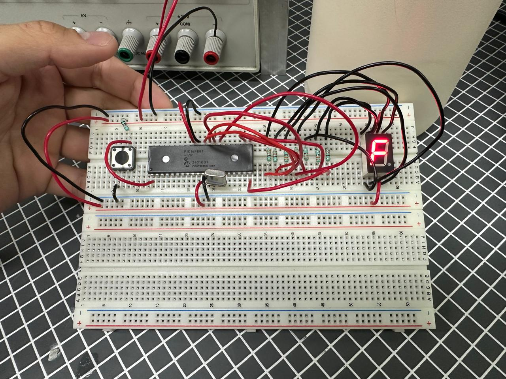
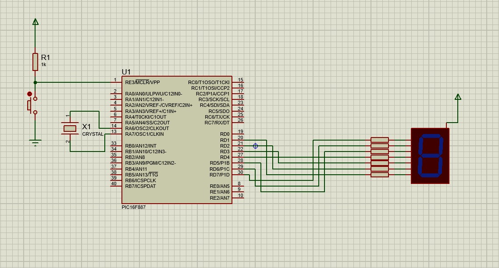

# Práctica 03 - Contador con display de 7 segmentos

## Objetivo

Programar un contador utilizando salidas digitales del microcontrolador PIC16F887 para controlar un display de 7 segmentos, mostrando primero una secuencia decimal del 0 al 9 y posteriormente una secuencia hexadecimal del 0 a la F.

---

## Material utilizado

- PIC16F887
- Display de 7 segmentos
- Protoboard
- Resistencias
- Fuente de alimentación
- Programador PIC
- Cables de conexión
- Botón
- Cristal de Cuarzo 8 MHz 

---

## Circuito armado

A continuación se muestra el circuito implementado en protoboard y su simulación en Proteus.

 

 

*Figura 1. Circuito armado en protoboard.*

  

 

*Figura 2. Simulación del circuito en Proteus.*

 

---

## Desarrollo

### Salidas digitales y display de 7 segmentos

En esta práctica se trabajó con el manejo de salidas digitales del microcontrolador PIC16F887 para controlar un display de 7 segmentos. Cada segmento del display se activó mediante una salida del microcontrolador, permitiendo formar diferentes números y caracteres de acuerdo con la combinación enviada desde el programa.

El display de 7 segmentos funciona encendiendo y apagando segmentos específicos para representar valores numéricos. Por esta razón, fue necesario definir las combinaciones correspondientes para cada número mostrado en el display.

La práctica se dividió en dos partes con el objetivo de comprender el control de un display de 7 segmentos y la generación de secuencias mediante programación.

### Parte 1: Contador decimal de 0 a 9

En la primera parte se programó un contador decimal que mostraba los números del 0 al 9 en el display de 7 segmentos. Cada número se visualizaba durante un intervalo de tiempo determinado antes de pasar al siguiente.

Al llegar al número 9, la secuencia regresaba nuevamente al 0, generando un ciclo continuo de conteo decimal. Esta actividad permitió comprobar el control individual de los segmentos y la correcta representación de los números.

### Parte 2: Contador hexadecimal de 0 a F

En la segunda parte se implementó un contador hexadecimal, en el cual el display mostraba los valores del 0 al 9 y posteriormente las letras A, B, C, D, E y F.

Después de mostrar la letra F, el contador regresaba automáticamente al 0, repitiendo la secuencia de forma continua. Esta parte permitió ampliar el uso del display más allá de los números decimales, utilizando combinaciones de segmentos para representar caracteres hexadecimales.

Mediante esta práctica se reforzaron conceptos relacionados con el manejo de salidas digitales, temporización, configuración de puertos y representación visual de datos mediante un display de 7 segmentos utilizando el microcontrolador PIC16F887.

---

## Archivos de programación

### Parte 1 - Contador decimal

📄 Archivo HEX utilizado para desplegar el conteo del 0 al 9:

- [Practica3_decimal.production.hex](Practica3_decimal.production.hex)

### Parte 2 - Contador hexadecimal

📄 Archivo HEX utilizado para desplegar el conteo hexadecimal del 0 a la F:

- [Practica3_hexadecimal.production.hex](Practica3_hexadecimal.production.hex)

---

## Resultados

Se logró visualizar correctamente la secuencia decimal del 0 al 9 y la secuencia hexadecimal del 0 a la F en el display de 7 segmentos. En ambos casos, el contador funcionó de manera cíclica, regresando al valor inicial después de llegar al último valor de la secuencia.

---

## Conclusiones

La práctica permitió comprender el funcionamiento de un display de 7 segmentos y la forma en que puede ser controlado mediante salidas digitales del PIC16F887. Además, se reforzó el uso de patrones binarios para representar números y caracteres, así como la programación de secuencias repetitivas mediante temporización.
