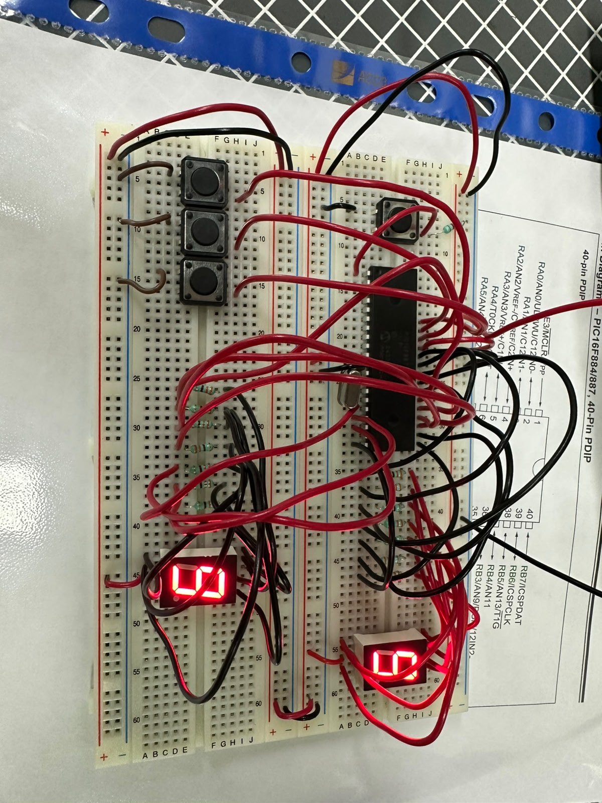
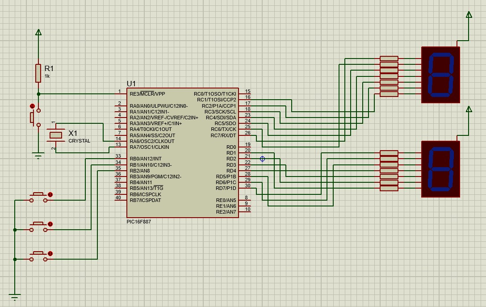

# Práctica 04 - Contador manual con dos displays de 7 segmentos

## Objetivo

Programar un contador manual utilizando dos displays de 7 segmentos y el microcontrolador PIC16F887 para visualizar números del 00 al 99, permitiendo incrementar y decrementar el valor mediante pulsadores, además de implementar un modo de conteo de dos en dos.

---

## Material utilizado

- PIC16F887
- 2 Displays de 7 segmentos
- Protoboard
- Resistencias
- Fuente de alimentación
- Programador PIC
- Cables de conexión
- Botones
- Cristal de Cuarzo 8 MHz 

---

## Circuito armado

A continuación se muestra el circuito implementado en protoboard y su simulación en Proteus.

 

 

*Figura 1. Circuito armado en protoboard.*

  

 

*Figura 2. Simulación del circuito en Proteus.*

 

---

## Desarrollo

### Manejo de entradas y salidas digitales

Para esta práctica se utilizaron entradas digitales mediante pulsadores y salidas digitales para controlar dos displays de 7 segmentos. El objetivo fue implementar un contador manual capaz de incrementar o decrementar su valor mediante la interacción del usuario, mostrando los resultados en un rango de 00 a 99.

La práctica se dividió en tres partes con el objetivo de comprender el manejo de entradas digitales, la detección de eventos mediante pulsadores y el control de múltiples displays para representar valores numéricos de dos dígitos.

### Parte 1: Incremento del contador

En la primera parte se programó un contador ascendente utilizando un pulsador. Cada vez que el botón era presionado, el valor mostrado en los displays aumentaba una unidad. El conteo iniciaba en 00 y avanzaba progresivamente hasta 99.

Esta actividad permitió comprender la lectura de entradas digitales y la actualización de información visual en tiempo real mediante los displays de 7 segmentos.

### Parte 2: Decremento del contador

En la segunda parte se implementó un pulsador adicional para realizar un conteo descendente. Cada vez que el botón era presionado, el valor mostrado en los displays disminuía una unidad.

Esta función permitió controlar el contador en ambas direcciones, verificando el correcto manejo de los valores mostrados y la actualización simultánea de ambos displays.

### Parte 3: Incremento y decremento de dos en dos

En la tercera parte se agregó un tercer pulsador encargado de modificar el modo de operación del contador. Al presionar este botón, el sistema cambiaba temporalmente el paso de conteo de una unidad a dos unidades.

Mientras esta función permanecía activa, los botones de incremento y decremento aumentaban o reducían el valor mostrado de dos en dos. Al volver a presionar el tercer pulsador, el contador regresaba a su funcionamiento normal, realizando incrementos y decrementos de una unidad.

Esta actividad permitió implementar modos de operación mediante entradas digitales y modificar dinámicamente el comportamiento del sistema durante la ejecución del programa.

Mediante esta práctica se reforzaron conceptos relacionados con el manejo de entradas y salidas digitales, lectura de pulsadores, control de displays de 7 segmentos, representación de números de dos dígitos y desarrollo de interfaces básicas de interacción utilizando el microcontrolador PIC16F887.

---

## Archivos de programación

### Programa principal

📄 Archivo HEX utilizado para programar el contador manual:

- [Practica4.production.hex](Practica_4_Contador.X.production.hex)

---

## Resultados

Se logró implementar correctamente un contador manual utilizando dos displays de 7 segmentos, permitiendo visualizar valores desde 00 hasta 99. El sistema respondió adecuadamente a los pulsadores de incremento y decremento, además de permitir cambiar dinámicamente entre conteos de una y dos unidades mediante un tercer botón de control.

---

## Conclusiones

La práctica permitió comprender la interacción entre entradas digitales y dispositivos de visualización, reforzando conceptos relacionados con el manejo de pulsadores, control de displays de 7 segmentos, representación numérica y diseño de sistemas interactivos utilizando el microcontrolador PIC16F887.
