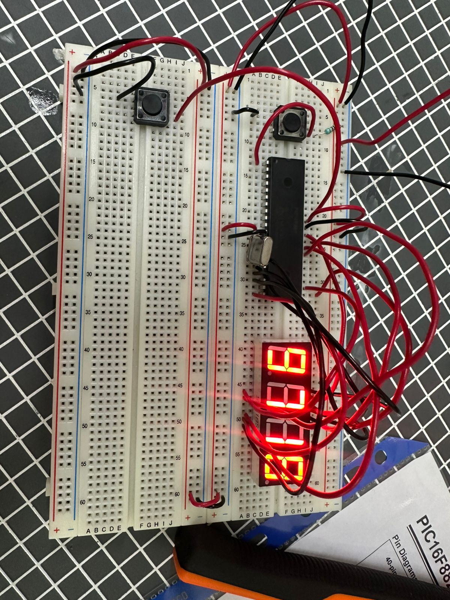
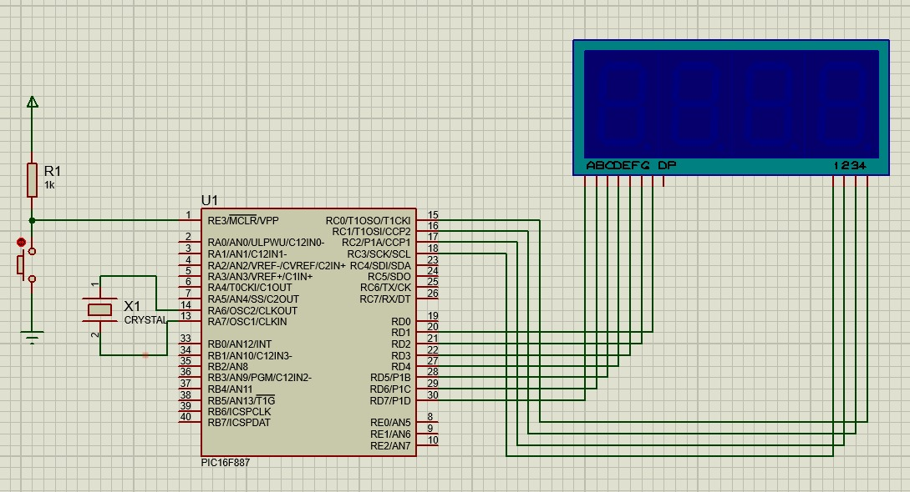

# Práctica 05 - Contador de 4 dígitos con displays de 7 segmentos

## Objetivo

Programar un contador de cuatro dígitos utilizando el microcontrolador PIC16F887 y cuatro displays de 7 segmentos para visualizar valores desde 0000 hasta 9999, permitiendo realizar conteos ascendentes y descendentes mediante pulsadores.

---

## Material utilizado

- PIC16F887
- 4 Displays de 7 segmentos
- Protoboard
- Resistencias
- 2 Pulsadores
- Cristal oscilador
- Fuente de alimentación
- Programador PIC
- Cables de conexión

---

## Circuito armado

A continuación se muestra el circuito implementado en protoboard para controlar los cuatro displays de 7 segmentos.

 

 

*Figura 1. Circuito armado en protoboard.*

  

 

*Figura 2. Simulación del circuito en Proteus.*

 

---

## Desarrollo

### Multiplexación de displays de 7 segmentos

Para esta práctica se utilizaron cuatro displays de 7 segmentos controlados por el PIC16F887. Debido a la cantidad de segmentos necesarios para controlar cada display, se empleó la técnica de multiplexación, la cual permite activar cada display de forma alternada a una velocidad suficientemente alta para que el ojo humano perciba los cuatro dígitos encendidos simultáneamente.

El sistema fue diseñado para mostrar números de cuatro cifras, utilizando cada display para representar unidades, decenas, centenas y millares.

La práctica se dividió en dos partes con el objetivo de comprender el control de múltiples displays y el manejo de contadores ascendentes y descendentes.

### Parte 1: Conteo ascendente

En la primera parte se implementó un contador ascendente controlado mediante un pulsador. Al presionar el botón, el sistema comenzaba a incrementar su valor desde 0000 hasta 9999, actualizando continuamente la información mostrada en los cuatro displays.

Cuando el contador alcanzaba el valor máximo de 9999 y se realizaba un nuevo incremento, el sistema regresaba automáticamente a 0000, continuando el ciclo de conteo de forma indefinida.

Esta actividad permitió comprender la representación de números de cuatro dígitos y la actualización simultánea de múltiples displays.

### Parte 2: Conteo descendente

En la segunda parte se implementó un modo de conteo descendente activado mediante un pulsador. Al presionar nuevamente el botón, el sistema cambiaba la dirección del conteo y comenzaba a disminuir el valor mostrado.

Cuando el contador alcanzaba el valor mínimo de 0000 y se realizaba una nueva disminución, el sistema regresaba automáticamente a 9999, permitiendo continuar el conteo descendente sin interrupciones.

Esta parte permitió comprender el manejo de límites superiores e inferiores dentro de un contador cíclico y la actualización dinámica de los cuatro displays de 7 segmentos.

Mediante esta práctica se reforzaron conceptos relacionados con la multiplexación de displays, control de salidas digitales, representación numérica, manejo de contadores y programación de sistemas secuenciales utilizando el microcontrolador PIC16F887.

---

## Archivos de programación

### Programa principal

📄 Archivo HEX utilizado para el contador de cuatro dígitos:

- [Practica5.production.hex](Practica5.production.hex)

---

## Resultados

Se logró implementar correctamente un contador de cuatro dígitos utilizando cuatro displays de 7 segmentos, permitiendo visualizar valores desde 0000 hasta 9999. El sistema respondió adecuadamente a los pulsadores de control, realizando conteos ascendentes y descendentes de manera continua y manteniendo un comportamiento cíclico en los límites del rango establecido.

---

## Conclusiones

La práctica permitió comprender el funcionamiento de sistemas de visualización de múltiples dígitos mediante displays de 7 segmentos y la técnica de multiplexación. Además, se reforzaron conocimientos relacionados con el manejo de contadores, control de salidas digitales, representación de números de gran tamaño y programación de secuencias utilizando el microcontrolador PIC16F887.
