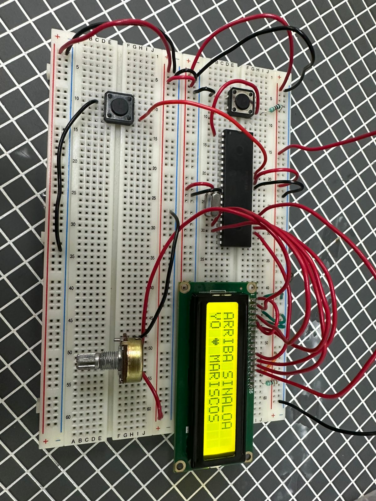
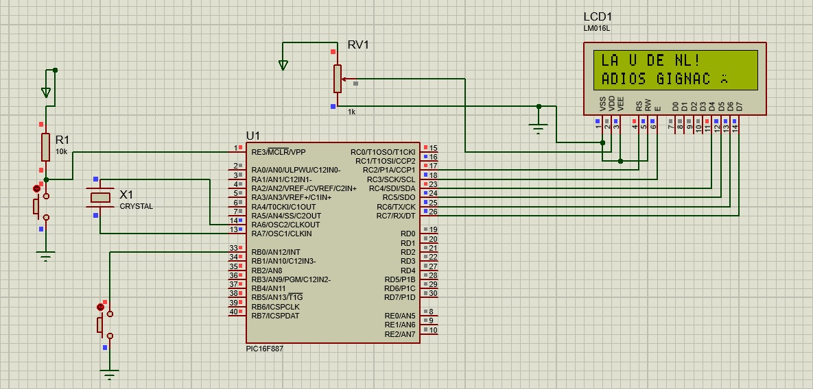

# Práctica 06 - Mensajes en LCD e interrupción externa

## Objetivo

Programar una pantalla LCD utilizando el microcontrolador PIC16F887 para mostrar mensajes en sus dos líneas, generar una secuencia de caracteres de forma automática e implementar una interrupción externa mediante un pulsador para cambiar el mensaje desplegado.

---

## Material utilizado

- PIC16F887
- Pantalla LCD 16x2
- Protoboard
- Potenciómetro
- Resistencias
- Fuente de alimentación
- Programador PIC
- Cables de conexión
- Botones
- Cristal de Cuarzo 8 MHz 

---

## Circuito armado

A continuación se muestra el circuito implementado en protoboard y su funcionamiento con la pantalla LCD.

 

 

*Figura 1. Circuito armado en protoboard con LCD.*

  

 

*Figura 2. Simulación del circuito en Proteus.*

 

---

## Desarrollo

### Manejo de pantalla LCD e interrupciones

Para esta práctica se utilizó una pantalla LCD 16x2 controlada mediante el microcontrolador PIC16F887. El objetivo fue mostrar mensajes en la pantalla y modificar la información desplegada mediante programación e interacción con un pulsador de interrupción.

La práctica se dividió en dos partes con el propósito de comprender el manejo de una LCD, la escritura de caracteres en diferentes líneas y el uso de interrupciones externas para cambiar el comportamiento del programa.

### Parte 1: Mensaje fijo y secuencia de caracteres

En la primera parte se programó la LCD para mostrar el mensaje **HELLO WORLD!** en la primera línea de la pantalla. Este mensaje permanecía fijo durante la ejecución del programa.

En la segunda línea se mostraban letras de la **A** a la **P**, apareciendo una por una cada cierto intervalo de tiempo. Al llegar a la letra **P**, la secuencia regresaba nuevamente a la letra **A**, repitiéndose de forma continua en ciclo.

Esta actividad permitió comprender el posicionamiento del cursor en la pantalla LCD, la escritura de caracteres y el uso de retardos para generar una secuencia visual.

### Parte 2: Mensaje personalizado e interrupción

En la segunda parte se creó un mensaje personalizado utilizando la pantalla LCD, incluyendo un carácter especial diseñado por el equipo. Este mensaje se mostró de manera normal en la pantalla como parte del funcionamiento principal del programa.

Además, se incorporó un pulsador configurado como interrupción externa. Al presionar el botón, el programa cambiaba el contenido mostrado en la LCD y desplegaba otro mensaje personalizado creado por el equipo.

Esta parte permitió observar cómo una interrupción puede modificar el flujo normal del programa sin necesidad de detener completamente la ejecución principal.

Mediante esta práctica se reforzaron conceptos relacionados con el manejo de pantallas LCD, visualización de mensajes, creación de caracteres especiales, control del cursor, temporización e implementación de interrupciones externas utilizando el microcontrolador PIC16F887.

---

## Archivos de programación

### Parte 1 - HELLO WORLD y secuencia A-P

📄 Archivo HEX utilizado para mostrar el mensaje fijo y la secuencia de caracteres:

- [Practica6_HelloWorld.production.hex](Practica6_Clase.X.production.hex)

### Parte 2 - Mensaje personalizado e interrupción

📄 Archivo HEX utilizado para mostrar el mensaje personalizado y activar el cambio mediante interrupción:

- [Practica6_InterrupcionLCD.production.hex](Practica_6.X.production.hex)

---

## Resultados

Se logró visualizar correctamente el mensaje **HELLO WORLD!** en la primera línea de la LCD, mientras que en la segunda línea se mostraron las letras de la **A** a la **P** de forma secuencial y repetitiva. También se consiguió mostrar un mensaje personalizado con un carácter especial y cambiar el mensaje desplegado al presionar el pulsador de interrupción.

---

## Conclusiones

La práctica permitió comprender el funcionamiento básico de una pantalla LCD 16x2 y su control mediante el PIC16F887. Además, se reforzó el uso de retardos, posicionamiento de caracteres, creación de caracteres personalizados e interrupciones externas para modificar la información mostrada durante la ejecución del programa.
