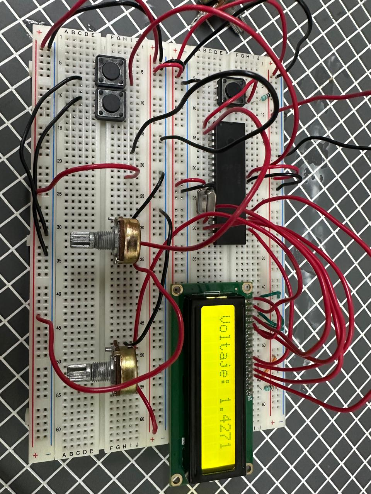
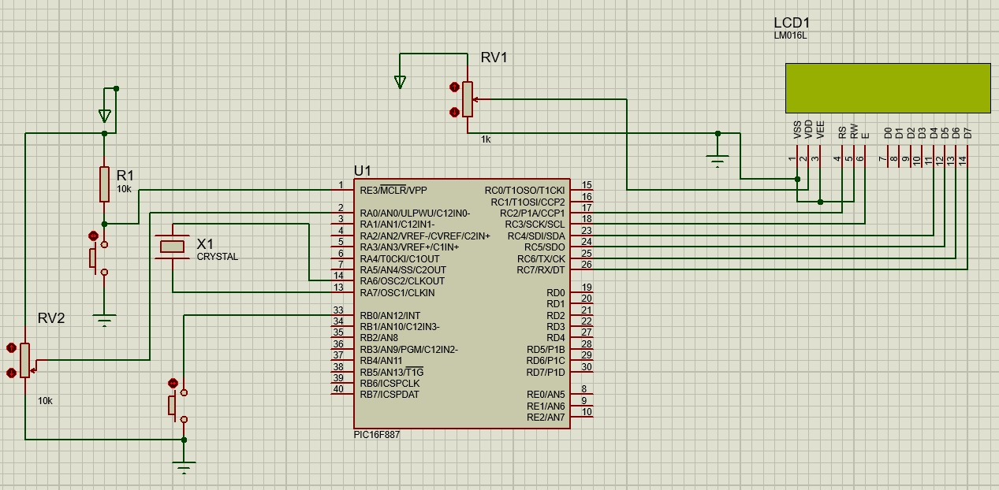

# Práctica 07 - Lectura Analógica 

## Objetivo

Configurar y utilizar el convertidor analógico-digital (ADC) del PIC16F887 para leer una señal analógica proveniente de un potenciómetro de 10 kΩ y mostrar diferentes representaciones de la medición en una pantalla LCD mediante el uso de interrupciones externas.

---

## Material utilizado

- PIC16F887
- Pantalla LCD 16x2
- Potenciómetro de 10 kΩ
- Pulsador
- Protoboard
- Resistencias
- Fuente de alimentación
- Programador PIC
- Cables de conexión

---

## Circuito armado

A continuación se muestra el circuito implementado en protoboard y su simulación en Proteus.

 

 

*Figura 1. Circuito armado en protoboard.*

  

 

*Figura 2. Simulación del circuito en Proteus.*

 

---

## Desarrollo

La práctica tuvo como objetivo introducir el uso de entradas analógicas en el microcontrolador PIC16F887 mediante la lectura de una señal variable generada por un potenciómetro de 10 kΩ. Para ello fue necesario configurar los registros ANSEL y ANSELH, los cuales permiten seleccionar qué pines del microcontrolador funcionarán como entradas analógicas para el convertidor analógico-digital (ADC).

El circuito se diseñó conectando un potenciómetro de 10 kΩ a una de las entradas analógicas del PIC16F887. Conforme se modificaba la posición del potenciómetro, el voltaje aplicado a la entrada variaba entre 0 V y 5 V. El microcontrolador realizaba conversiones analógico-digitales de manera continua y procesaba los datos obtenidos para mostrarlos en una pantalla LCD en tiempo real.

Además, se implementó una interrupción externa mediante un botón pulsador. Cada vez que el usuario presionaba el botón, el sistema cambiaba entre tres modos distintos de visualización en la pantalla LCD.

### Modo 1: Voltaje

En este modo se mostraba el valor de voltaje medido en la entrada analógica. Conforme se ajustaba el potenciómetro, el valor desplegado en la pantalla LCD cambiaba de manera continua y en tiempo real.

### Modo 2: Porcentaje

En este modo se calculaba el porcentaje del voltaje respecto al valor máximo de referencia utilizado por el ADC. Esto permitía visualizar de forma más intuitiva el nivel de la señal analógica recibida.

### Modo 3: Valor ADC

En este modo se mostraba directamente el resultado digital generado por el convertidor analógico-digital. Debido a que el ADC del PIC16F887 posee una resolución de 10 bits, los valores obtenidos variaban entre 0 y 1023.

### Conversión Analógico-Digital (ADC)

El convertidor analógico-digital (ADC) permite transformar una señal analógica continua en un valor digital que puede ser procesado por el microcontrolador. En esta práctica, el ADC convirtió el voltaje generado por el potenciómetro en un valor numérico proporcional, el cual posteriormente fue utilizado para calcular el voltaje real, el porcentaje de referencia y el valor digital correspondiente.

### Interrupción externa

Para facilitar la interacción con el sistema se utilizó una interrupción externa asociada a un pulsador. Gracias a esta técnica, el microcontrolador pudo detectar automáticamente la pulsación del botón y cambiar entre los diferentes modos de visualización sin interrumpir el proceso de lectura analógica. Esto permitió una operación más eficiente que el uso de monitoreo continuo mediante sondeo (polling).

Mediante esta práctica se reforzaron conceptos relacionados con la configuración de entradas analógicas, el funcionamiento del convertidor ADC, el uso de interrupciones externas y la visualización de información en una pantalla LCD utilizando el microcontrolador PIC16F887.

---

## Código fuente

El programa fue compilado para el microcontrolador PIC16F887. A continuación se adjunta el archivo HEX utilizado para programar el dispositivo durante la práctica.

📄 **Archivo HEX:**

- [Practica_7.X.production.hex](Practica_7.X.production.hex)

---

## Resultados

Se logró realizar la lectura correcta de la señal analógica generada por el potenciómetro y visualizarla en tiempo real en la pantalla LCD. Asimismo, la interrupción externa permitió alternar correctamente entre los tres modos de visualización: voltaje, porcentaje y valor ADC, verificando el correcto funcionamiento del sistema.

---

## Conclusiones

La práctica permitió comprender el funcionamiento del convertidor analógico-digital del PIC16F887 y la importancia de la configuración de los registros ANSEL y ANSELH para habilitar entradas analógicas. Además, se reforzaron conocimientos sobre interrupciones externas y despliegue de información en pantallas LCD, integrando múltiples periféricos del microcontrolador en una misma aplicación.
