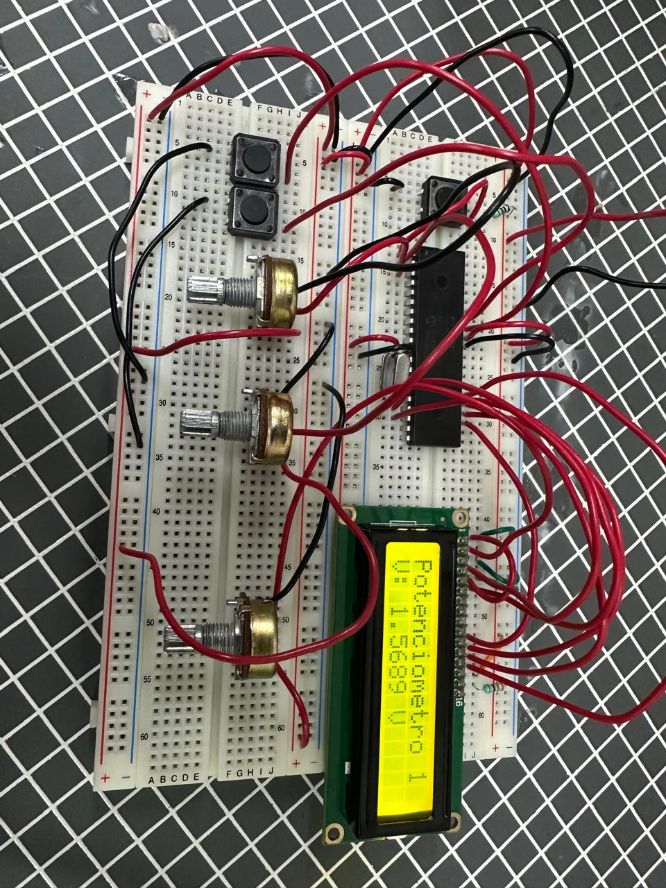
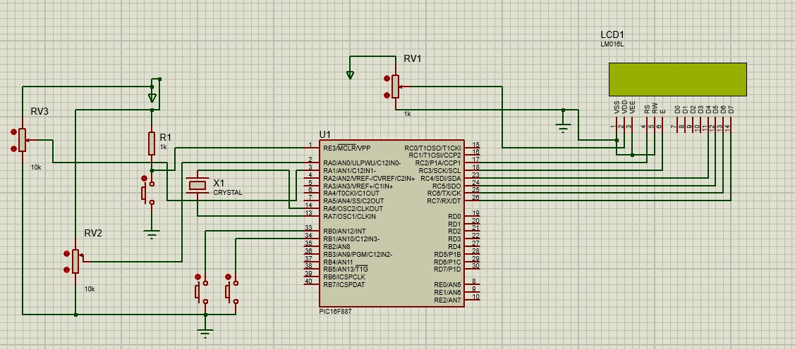

# Práctica 08 - Lectura de múltiples entradas analógicas mediante interrupciones

## Objetivo

Implementar la lectura de dos señales analógicas utilizando el convertidor analógico-digital (ADC) del PIC16F887 y mostrar la información correspondiente en una pantalla LCD. Además, utilizar interrupciones externas para alternar entre distintos modos de visualización y entre las dos entradas analógicas disponibles.

---

## Material utilizado

- PIC16F887
- Pantalla LCD 16x2
- 2 Potenciómetros de 10 kΩ
- 2 Pulsadores
- Protoboard
- Resistencias
- Fuente de alimentación
- Programador PIC
- Cables de conexión

---

## Circuito armado

A continuación se muestra el circuito implementado en protoboard y su simulación en Proteus.

 

 

*Figura 1. Circuito armado en protoboard.*

  

 

*Figura 2. Simulación del circuito en Proteus.*

 

---

## Desarrollo

Esta práctica consistió en ampliar el sistema desarrollado en la práctica anterior mediante la incorporación de una segunda entrada analógica y una segunda interrupción externa. Para ello se utilizaron dos potenciómetros de 10 kΩ conectados a diferentes canales analógicos del PIC16F887, permitiendo obtener dos mediciones independientes de voltaje.

Al igual que en la práctica anterior, fue necesario configurar los registros ANSEL y ANSELH para habilitar los canales analógicos requeridos y permitir el funcionamiento correcto del convertidor analógico-digital (ADC). El microcontrolador realizaba conversiones de manera continua para obtener los valores correspondientes a cada potenciómetro y desplegarlos en una pantalla LCD.

Se utilizaron dos botones configurados mediante interrupciones externas para controlar la información mostrada en la pantalla.

### Selección de la entrada analógica

El primer botón permitía alternar entre las dos entradas analógicas disponibles. De esta manera, el usuario podía seleccionar cuál de los dos potenciómetros deseaba monitorear en la pantalla LCD. Cada vez que se presionaba el botón, el sistema cambiaba entre la lectura del Potenciómetro 1 y la lectura del Potenciómetro 2.

### Modos de visualización

El segundo botón conservó la misma función implementada en la práctica anterior. Mediante una interrupción externa se alternaba entre tres modos distintos de visualización para la entrada analógica seleccionada.

#### Modo 1: Voltaje

En este modo se mostraba el valor de voltaje correspondiente a la entrada analógica seleccionada. El valor se actualizaba en tiempo real conforme se modificaba la posición del potenciómetro.

#### Modo 2: Porcentaje

En este modo se calculaba el porcentaje del voltaje medido respecto al voltaje máximo de referencia del ADC, proporcionando una representación más intuitiva del nivel de la señal.

#### Modo 3: Valor ADC

En este modo se mostraba directamente el valor digital obtenido por el convertidor analógico-digital del PIC16F887, con un rango comprendido entre 0 y 1023 debido a la resolución de 10 bits del ADC.

### Conversión Analógico-Digital (ADC)

El ADC del PIC16F887 permitió convertir las señales analógicas generadas por ambos potenciómetros en valores digitales procesables por el microcontrolador. Posteriormente, dichos valores fueron utilizados para calcular el voltaje real y el porcentaje correspondiente, mostrando los resultados en la pantalla LCD.

### Interrupciones externas

Las interrupciones externas permitieron implementar una interfaz de usuario eficiente mediante dos botones. El primero se encargó de seleccionar cuál de las dos entradas analógicas se visualizaría en la pantalla, mientras que el segundo permitió cambiar entre los diferentes modos de despliegue. Gracias a este enfoque, el sistema pudo responder de manera inmediata a las acciones del usuario sin afectar el proceso continuo de adquisición de datos.

Mediante esta práctica se reforzaron conceptos relacionados con el manejo de múltiples canales analógicos, el funcionamiento del ADC, el uso de interrupciones externas y la visualización dinámica de información en una pantalla LCD utilizando el microcontrolador PIC16F887.

---

## Código fuente

El programa fue compilado para el microcontrolador PIC16F887. A continuación se adjunta el archivo HEX utilizado para programar el dispositivo durante la práctica.

📄 **Archivo HEX:**

- [Practica_8.X.production.hex](Practica_8.X.production.hex)

---

## Resultados

Se logró realizar la lectura correcta de dos señales analógicas independientes mediante el uso de dos potenciómetros. Asimismo, las interrupciones externas permitieron alternar correctamente entre las entradas analógicas y los diferentes modos de visualización, verificando el correcto funcionamiento del sistema.

---

## Conclusiones

La práctica permitió ampliar los conocimientos adquiridos sobre el convertidor analógico-digital del PIC16F887 mediante el manejo simultáneo de múltiples canales analógicos. Además, se reforzó el uso de interrupciones externas como mecanismo de interacción con el usuario y la integración de diferentes periféricos para desarrollar aplicaciones más completas y funcionales.
