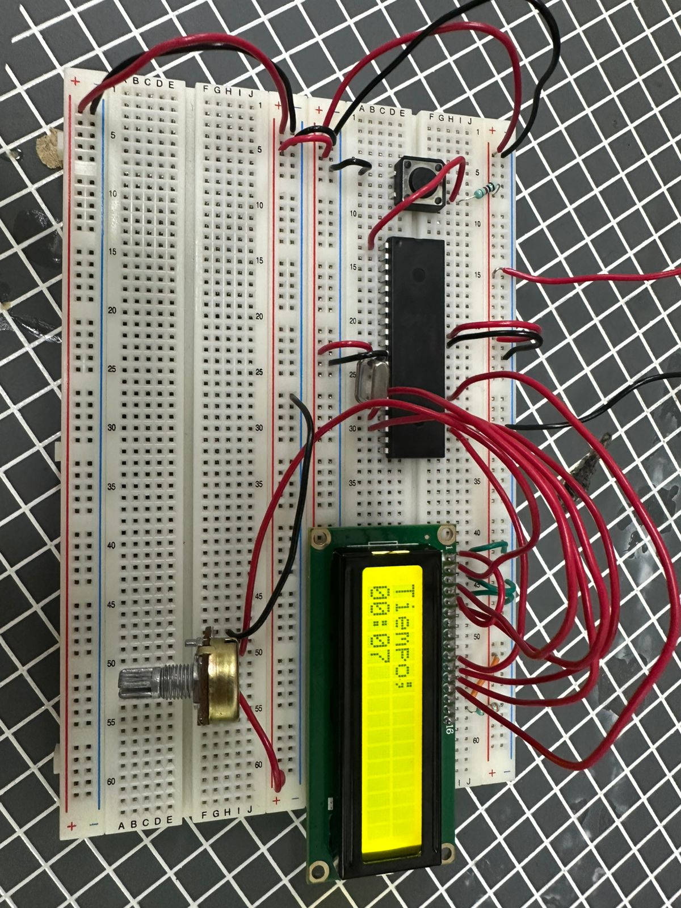
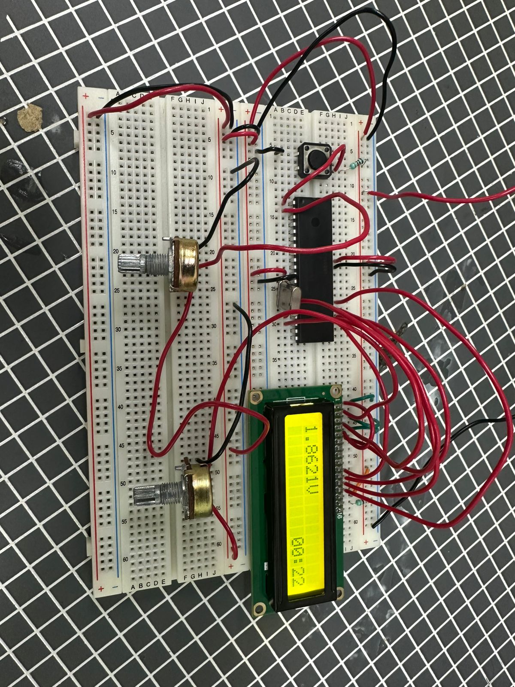
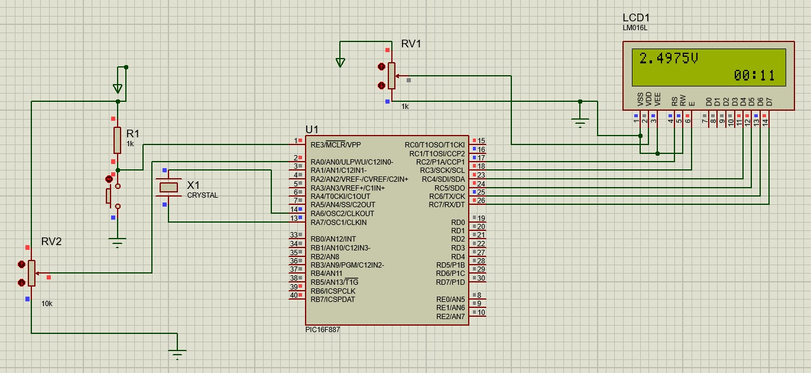

# Práctica 09 - Temporizador y medición de voltaje con LCD

## Objetivo

Programar una pantalla LCD utilizando el microcontrolador PIC16F887 para mostrar información en tiempo real. En la primera parte se implementó un temporizador para visualizar el tiempo transcurrido, mientras que en la segunda parte se realizó la medición de voltaje mediante un potenciómetro utilizando el convertidor analógico-digital (ADC) del microcontrolador.

---

## Material utilizado

- PIC16F887
- Pantalla LCD 16x2
- Protoboard
- 2 Potenciómetros
- Pulsador
- Cristal oscilador
- Resistencias
- Fuente de alimentación
- Programador PIC
- Cables de conexión

---

## Circuito armado

A continuación se muestra el circuito implementado en protoboard para el temporizador y la medición de voltaje.

 

 

*Figura 1. Circuito armado en protoboard.*

 

 

*Figura 2. Circuito 2 armado en protoboard.*

 

 

*Figura 3. Simulación del circuito en Proteus.*

 

---

## Desarrollo

### Pantalla LCD y conversión analógica-digital

Para esta práctica se utilizó una pantalla LCD 16x2 para visualizar información generada por el microcontrolador PIC16F887. Además, se empleó el módulo ADC (Convertidor Analógico-Digital) para leer la señal proveniente de un potenciómetro y convertirla en un valor de voltaje mostrado en la pantalla.

La práctica se dividió en dos partes con el objetivo de comprender el manejo de temporizadores, visualización de datos en una LCD y adquisición de señales analógicas mediante el ADC integrado del microcontrolador.

### Parte 1: Temporizador

En la primera parte se desarrolló un temporizador capaz de mostrar el tiempo transcurrido en la pantalla LCD. El sistema actualizaba continuamente la información mostrada, permitiendo visualizar el avance del tiempo durante la ejecución del programa.

Esta actividad permitió comprender el uso de retardos, temporización y actualización dinámica de información en una pantalla LCD.

### Parte 2: Medición de voltaje mediante potenciómetro

En la segunda parte se utilizó un potenciómetro conectado a una entrada analógica del PIC16F887. El valor analógico generado por la posición del potenciómetro era convertido a formato digital mediante el módulo ADC del microcontrolador.

Posteriormente, el valor obtenido se transformaba en una lectura de voltaje y se mostraba en tiempo real en la pantalla LCD. Conforme se giraba el potenciómetro, el voltaje visualizado aumentaba o disminuía de manera proporcional.

Esta actividad permitió comprender el funcionamiento del convertidor analógico-digital y la adquisición de señales analógicas utilizando el PIC16F887.

Mediante esta práctica se reforzaron conceptos relacionados con el manejo de pantallas LCD, temporización, lectura de entradas analógicas, conversión analógico-digital y visualización de datos en tiempo real utilizando el microcontrolador PIC16F887.

---

## Archivos de programación

### Parte 1 - Temporizador

📄 Archivo HEX utilizado para el temporizador:

- [Practica9_Timer.production.hex](Practica9_Timer.production.hex)

### Parte 2 - Medición de voltaje

📄 Archivo HEX utilizado para la lectura de voltaje mediante ADC:

- [Practica9_ADC.production.hex](Practica9_ADC.production.hex)

---

## Resultados

Se logró visualizar correctamente el tiempo transcurrido en la pantalla LCD mediante el temporizador implementado. Asimismo, fue posible medir y mostrar en tiempo real el voltaje generado por el potenciómetro, observando cambios proporcionales conforme se modificaba su posición.

---

## Conclusiones

La práctica permitió comprender la integración de diferentes periféricos del PIC16F887, combinando el uso de temporizadores, pantallas LCD y el módulo ADC. Además, se reforzaron conocimientos relacionados con la adquisición de señales analógicas, procesamiento de datos y visualización de información en tiempo real.
