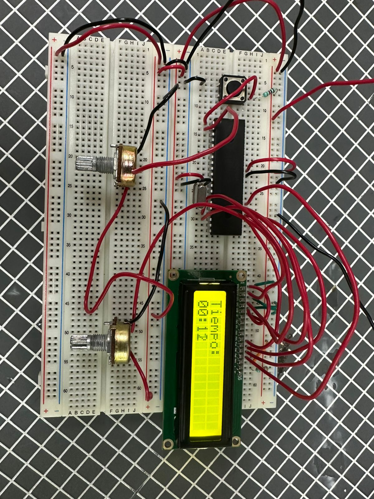
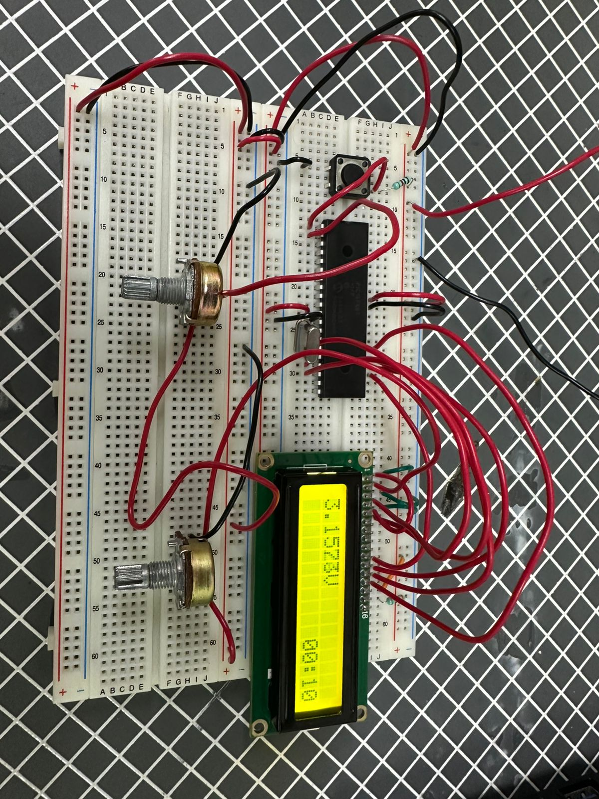
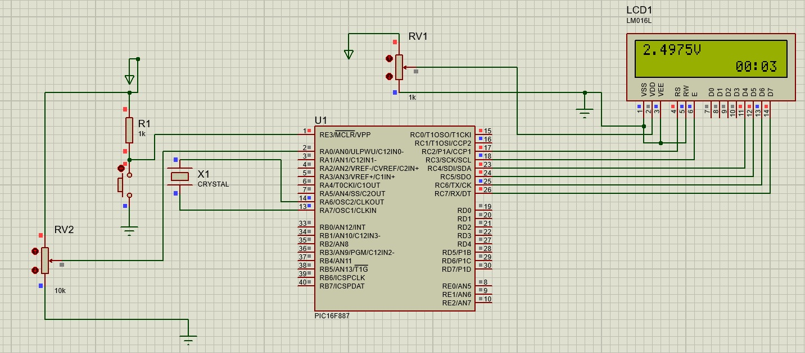

# Práctica 10 - Timer 1

## Objetivo

Programar una pantalla LCD utilizando el microcontrolador PIC16F887 para mostrar información en tiempo real. En la primera parte se implementó un temporizador utilizando el módulo Timer1 para visualizar el tiempo transcurrido, mientras que en la segunda parte se realizó la medición de voltaje mediante un potenciómetro utilizando el convertidor analógico-digital (ADC) del microcontrolador.

---

## Material utilizado

- PIC16F887
- Pantalla LCD 16x2
- Protoboard
- 2 Potenciómetros
- Pulsador
- Cristal oscilador
- Resistencias
- Fuente de alimentación
- Programador PIC
- Cables de conexión

---

## Circuito armado

A continuación se muestra el circuito implementado en protoboard para el temporizador y la medición de voltaje.

 

 

*Figura 1. Circuito armado en protoboard.*

 

 

*Figura 2. Circuito 2 armado en protoboard.*

 

 

*Figura 3. Simulación del circuito en Proteus.*

 

---

## Desarrollo

### Timer1, LCD y conversión analógica-digital

Para esta práctica se utilizó una pantalla LCD 16x2 para visualizar información generada por el microcontrolador PIC16F887. Además, se empleó el módulo ADC (Convertidor Analógico-Digital) para leer la señal proveniente de un potenciómetro y convertirla en un valor de voltaje mostrado en la pantalla.

A diferencia de prácticas anteriores, en esta ocasión se utilizó el módulo **Timer1** para llevar el control del tiempo transcurrido. Esto requirió una configuración distinta del microcontrolador, ya que Timer1 cuenta con características diferentes a Timer0, como un registro de 16 bits y opciones adicionales de temporización que permiten obtener intervalos de tiempo más precisos.

La práctica se dividió en dos partes con el objetivo de comprender el funcionamiento de Timer1, la visualización de información en una pantalla LCD y la adquisición de señales analógicas mediante el ADC integrado del PIC16F887.

### Parte 1: Temporizador utilizando Timer1

En la primera parte se desarrolló un temporizador capaz de mostrar el tiempo transcurrido en la pantalla LCD. Para ello se configuró el módulo Timer1 para generar incrementos periódicos que permitieran actualizar los segundos mostrados en pantalla.

El tiempo transcurrido se visualizaba continuamente en formato de minutos y segundos, actualizando la información conforme avanzaba el conteo. Gracias al uso de Timer1 fue posible realizar esta función sin depender únicamente de retardos por software, obteniendo una medición más precisa y estable.

Esta actividad permitió comprender la configuración y utilización de temporizadores internos del microcontrolador para aplicaciones de medición de tiempo.

### Parte 2: Medición de voltaje mediante ADC

En la segunda parte se utilizó un potenciómetro conectado a una entrada analógica del PIC16F887. El valor analógico generado por la posición del potenciómetro era convertido a formato digital mediante el módulo ADC del microcontrolador.

Posteriormente, el valor digital obtenido se transformaba en una lectura de voltaje y se mostraba en tiempo real en la pantalla LCD. Conforme se giraba el potenciómetro, el voltaje visualizado aumentaba o disminuía de manera proporcional.

Esta actividad permitió comprender el funcionamiento del convertidor analógico-digital y la adquisición de señales analógicas utilizando el PIC16F887.

Mediante esta práctica se reforzaron conceptos relacionados con el manejo de pantallas LCD, temporización mediante Timer1, lectura de entradas analógicas, conversión analógico-digital y visualización de datos en tiempo real utilizando el microcontrolador PIC16F887.

---

## Archivos de programación

### Parte 1 - Temporizador con Timer1

📄 Archivo HEX utilizado para el temporizador:

- [Practica10_Timer1.production.hex](Practica_10.X.production.hex)

### Parte 2 - Medición de voltaje mediante ADC

📄 Archivo HEX utilizado para la lectura de voltaje:

- [Practica10_ADC.production.hex](Practica_10_Tiempo.X.production.hex)

---

## Resultados

Se logró visualizar correctamente el tiempo transcurrido en la pantalla LCD utilizando Timer1 para el control de la temporización. Asimismo, fue posible medir y mostrar en tiempo real el voltaje generado por el potenciómetro, observando cambios proporcionales conforme se modificaba su posición.

---

## Conclusiones

La práctica permitió comprender el uso del módulo Timer1 para aplicaciones de temporización y medición de tiempo dentro del PIC16F887. Además, se reforzaron conocimientos relacionados con la adquisición de señales analógicas mediante el ADC y la visualización de información en tiempo real utilizando una pantalla LCD.
