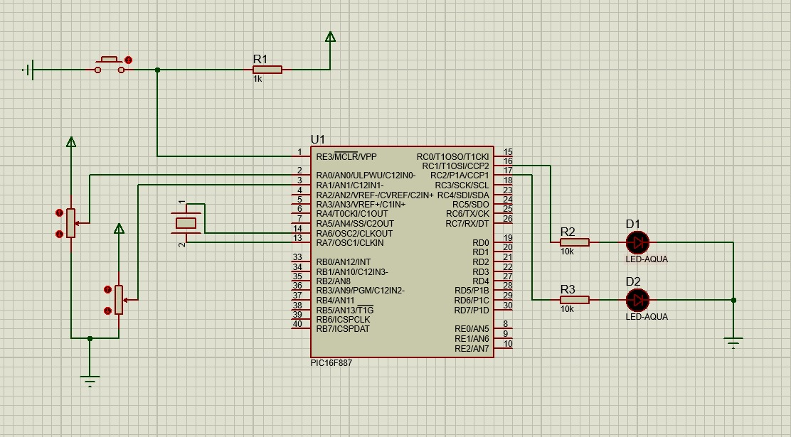

# Práctica 11 - PWM por Hardware y PWM por Software

## Objetivo

Implementar el control de intensidad luminosa de LEDs utilizando la técnica de Modulación por Ancho de Pulso (PWM) en el microcontrolador PIC16F887. En la primera parte se utilizó PWM por hardware para controlar un LED mediante un potenciómetro, mientras que en la segunda parte se controlaron dos LEDs utilizando simultáneamente PWM por hardware y PWM por software.

---

## Material utilizado

- PIC16F887
- 2 LEDs
- 2 Potenciómetros
- Protoboard
- Resistencias
- Cristal oscilador
- Fuente de alimentación
- Programador PIC
- Cables de conexión

---

## Circuito armado

A continuación se muestra la simulación implementada en Proteus para el control de intensidad de los LEDs.

 

 

*Figura 1. Simulación del sistema de control de intensidad mediante PWM.*

 

*Figura 2. Circuito 2 armado en protoboard.*

 

 

---

## Desarrollo

### Modulación por Ancho de Pulso (PWM)

Para esta práctica se utilizó la técnica de Modulación por Ancho de Pulso (PWM), la cual permite controlar la potencia promedio suministrada a una carga variando el ciclo de trabajo de una señal digital. Mediante esta técnica es posible modificar el brillo de un LED sin cambiar directamente el voltaje aplicado.

La práctica se dividió en dos partes con el objetivo de comprender las diferencias entre PWM por hardware y PWM por software, así como su aplicación en el control de intensidad luminosa.

### Parte 1: Control de un LED mediante PWM Hardware

En la primera parte se utilizó uno de los módulos CCP (Capture/Compare/PWM) del PIC16F887 para generar una señal PWM por hardware. Un potenciómetro conectado a una entrada analógica permitía modificar el ciclo de trabajo de la señal.

El valor analógico generado por el potenciómetro era leído mediante el módulo ADC del microcontrolador y posteriormente utilizado para ajustar el duty cycle del PWM. Conforme se modificaba la posición del potenciómetro, el brillo del LED aumentaba o disminuía de manera proporcional.

Esta actividad permitió comprender el funcionamiento del PWM por hardware y su integración con el convertidor analógico-digital.

### Parte 2: Control de dos LEDs mediante PWM Hardware y PWM Software

En la segunda parte se implementó el control independiente de dos LEDs utilizando dos potenciómetros. El primer LED continuó siendo controlado mediante PWM por hardware utilizando el módulo CCP del microcontrolador.

Para el segundo LED se desarrolló una implementación de PWM por software, generando manualmente la señal PWM mediante programación y temporización. Un segundo potenciómetro permitía modificar el ciclo de trabajo correspondiente a este LED.

De esta forma fue posible comparar ambos métodos de generación PWM y observar cómo ambos permiten controlar la intensidad luminosa de manera similar, aunque mediante técnicas de implementación diferentes.

Esta actividad permitió comprender las ventajas y limitaciones de cada método, así como la utilización simultánea de entradas analógicas y salidas PWM dentro de una misma aplicación.

Mediante esta práctica se reforzaron conceptos relacionados con el convertidor analógico-digital, generación de señales PWM, control de intensidad luminosa, módulos CCP y técnicas de temporización utilizando el microcontrolador PIC16F887.

---

## Archivo de programación

### PWM Hardware y PWM Software

📄 Archivo HEX utilizado para el control simultáneo de dos LEDs:

- [Practica11_PWMDual.production.hex](Practica_11.X.production.hex)

---

## Resultados

Se logró controlar correctamente la intensidad luminosa de un LED mediante PWM por hardware utilizando un potenciómetro como entrada de control. Asimismo, fue posible controlar de forma independiente dos LEDs utilizando simultáneamente PWM por hardware y PWM por software, observando cambios proporcionales en el brillo conforme se modificaban los potenciómetros.

---

## Conclusiones

La práctica permitió comprender el funcionamiento de la Modulación por Ancho de Pulso (PWM) y su aplicación en el control de intensidad luminosa. Además, se reforzaron conocimientos relacionados con el uso del ADC, los módulos CCP del PIC16F887 y la implementación de PWM tanto por hardware como por software, permitiendo comparar las características y ventajas de cada método.
