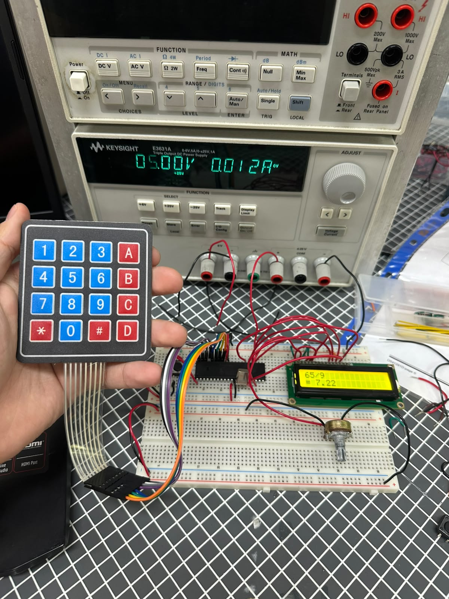
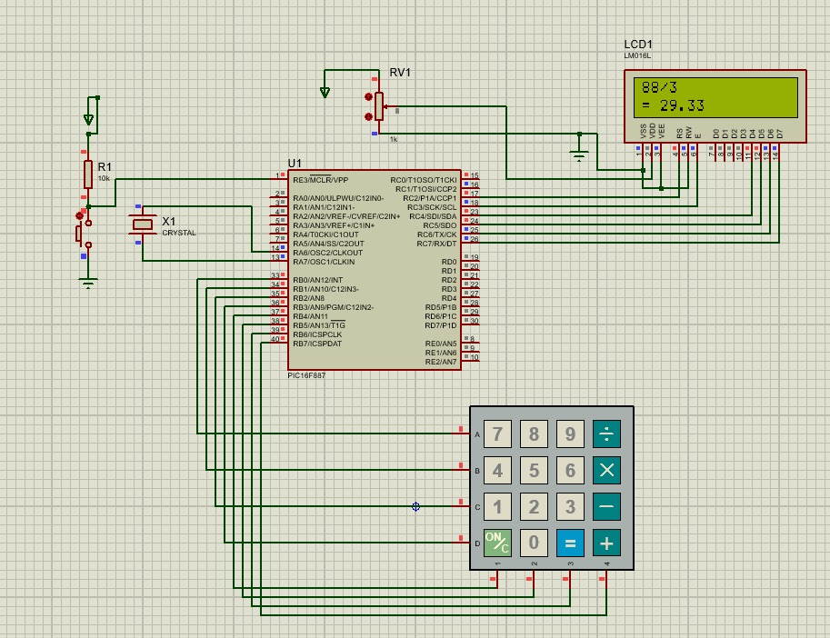

# Práctica 12 - Teclado matricial y calculadora básica

## Objetivo

Implementar el uso de un teclado matricial conectado al microcontrolador PIC16F887 para capturar datos ingresados por el usuario. En la primera parte se mostraron en una pantalla LCD los caracteres presionados en el teclado matricial, mientras que en la segunda parte se desarrolló una calculadora básica capaz de realizar operaciones aritméticas y mostrar resultados con valores decimales.

---

## Material utilizado

- PIC16F887
- Pantalla LCD 16x2
- Teclado matricial 4x4
- Protoboard
- Resistencias
- Cristal oscilador
- Fuente de alimentación
- Programador PIC
- Cables de conexión

---

## Circuito armado

A continuación se muestra el circuito implementado en protoboard y su simulación en Proteus.

 

 

*Figura 1. Circuito armado en protoboard.*

  

 

*Figura 2. Simulación del sistema en Proteus.*

 

---

## Desarrollo

### Lectura de teclado matricial

Para esta práctica se utilizó un teclado matricial como dispositivo de entrada y una pantalla LCD como medio de visualización. El teclado matricial permite identificar qué tecla ha sido presionada mediante el escaneo de filas y columnas, enviando posteriormente la información al microcontrolador para su procesamiento.

La práctica se dividió en dos partes con el objetivo de comprender la lectura de teclados matriciales y el desarrollo de aplicaciones interactivas utilizando una pantalla LCD.

### Parte 1: Visualización de caracteres en LCD

En la primera parte se programó el PIC16F887 para detectar cada tecla presionada en el teclado matricial y mostrar el carácter correspondiente en la pantalla LCD.

Cada vez que el usuario presionaba una tecla, el carácter asociado aparecía en la pantalla, permitiendo verificar el correcto funcionamiento del sistema de lectura del teclado. Esta actividad permitió comprender el proceso de escaneo de filas y columnas utilizado en los teclados matriciales.

### Parte 2: Calculadora básica

En la segunda parte se desarrolló una calculadora básica utilizando el teclado matricial como dispositivo de entrada y la pantalla LCD para mostrar los resultados.

El sistema permitía ingresar dos números y seleccionar una operación aritmética entre suma, resta, multiplicación y división. Una vez ingresados los datos, el resultado era calculado por el microcontrolador y mostrado en la pantalla LCD.

Además, la calculadora fue capaz de mostrar resultados con valores decimales cuando la operación lo requería, especialmente en divisiones cuyos resultados no eran números enteros.

Esta actividad permitió integrar dispositivos de entrada y salida dentro de una misma aplicación, desarrollando una interfaz interactiva completamente funcional.

Mediante esta práctica se reforzaron conceptos relacionados con el manejo de teclados matriciales, visualización de información en LCD, procesamiento de datos ingresados por el usuario, operaciones matemáticas y desarrollo de aplicaciones interactivas utilizando el microcontrolador PIC16F887.

---

## Archivos de programación

### Parte 1 - Lectura de teclado matricial

📄 Archivo HEX utilizado para mostrar los caracteres en la LCD:

- [Practica12_Teclado.production.hex](Practica12_Teclado.production.hex)

### Parte 2 - Calculadora básica

📄 Archivo HEX utilizado para la calculadora:

- [Practica12_Calculadora.production.hex](Practica12_Calculadora.production.hex)

---

## Resultados

Se logró detectar correctamente cada una de las teclas del teclado matricial y mostrar los caracteres correspondientes en la pantalla LCD. Asimismo, fue posible implementar una calculadora funcional capaz de realizar operaciones de suma, resta, multiplicación y división, mostrando resultados enteros y decimales de manera correcta.

---

## Conclusiones

La práctica permitió comprender el funcionamiento de los teclados matriciales como dispositivos de entrada y su integración con una pantalla LCD. Además, se reforzaron conocimientos relacionados con el procesamiento de información ingresada por el usuario, el desarrollo de interfaces interactivas y la implementación de operaciones matemáticas utilizando el microcontrolador PIC16F887.
