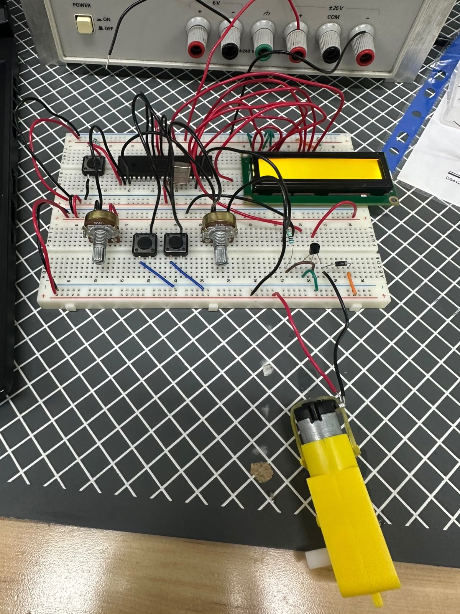
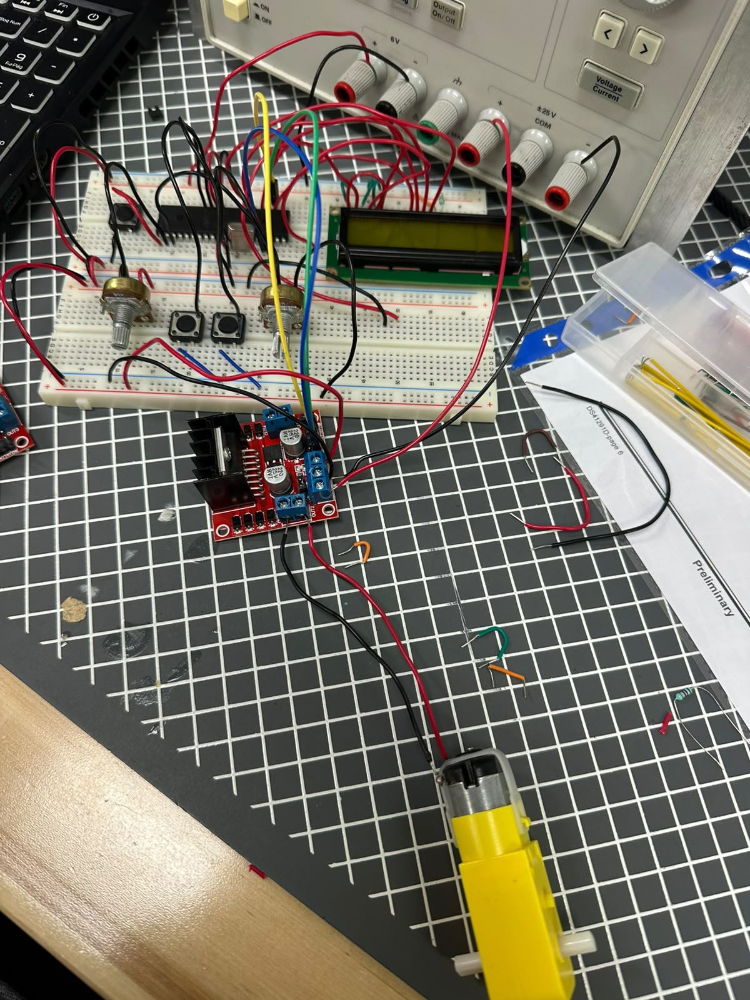
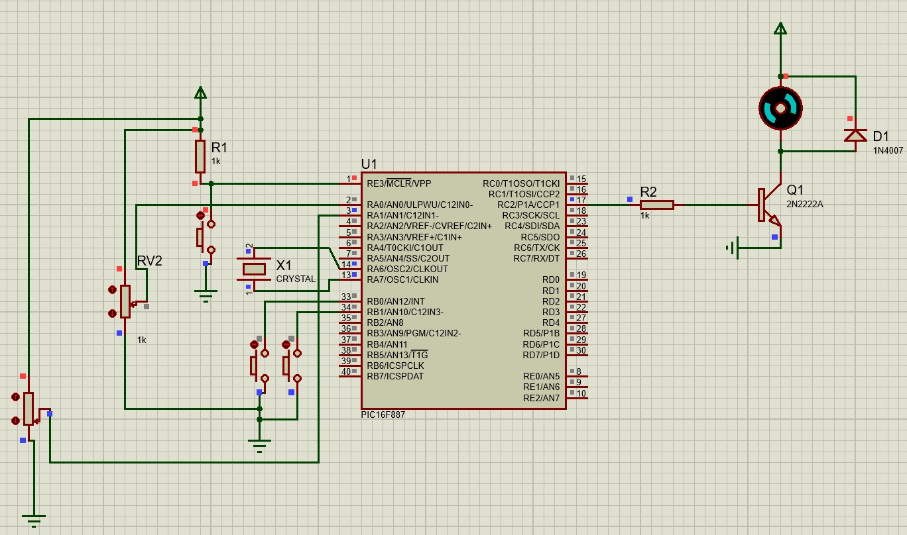
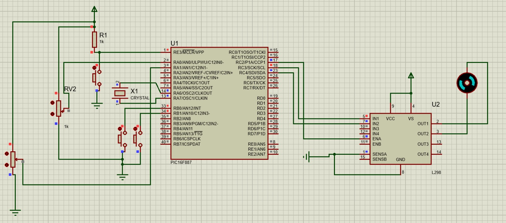

# Práctica 13 - Control de motores DC

## Objetivo

Implementar el control de velocidad y sentido de giro de motores de corriente directa (DC) utilizando el microcontrolador PIC16F887. En la primera parte se controló la velocidad mediante un circuito driver basado en transistores BJT y PWM, mientras que en la segunda parte se controló tanto la velocidad como el sentido de giro utilizando un puente H y pulsadores.

---

## Material utilizado

- PIC16F887
- Motor DC
- Transistores BJT
- Puente H
- Pulsadores
- Potenciómetro
- Protoboard
- Resistencias
- Diodos de protección
- Cristal oscilador
- Fuente de alimentación
- Programador PIC
- Cables de conexión

---

## Circuito armado

A continuación se muestra el circuito implementado en protoboard y su simulación en Proteus.

 

 

*Figura 1. Circuito armado en protoboard.*

 

 

*Figura 2. Circuito 2 armado en protoboard.*

 

 

*Figura 3. Simulación del circuito en Proteus.*

 

 

*Figura 4. Simulación del circuito 2 en Proteus.*

 

---

## Desarrollo

### Control de motores mediante PWM

Para esta práctica se trabajó con motores de corriente directa (DC), utilizando señales PWM para controlar la potencia suministrada al motor y, por lo tanto, su velocidad de rotación. Además, se utilizaron circuitos de potencia para manejar la corriente requerida por el motor sin afectar directamente al microcontrolador.

La práctica se dividió en dos partes con el objetivo de comprender los principios básicos de control de velocidad y control de dirección de motores DC.

### Parte 1: Control de velocidad mediante driver basado en BJT

En la primera parte se implementó un circuito driver utilizando transistores BJT para controlar un motor DC. El PIC16F887 generó una señal PWM cuyo ciclo de trabajo determinaba la cantidad de potencia entregada al motor.

Al modificar el valor de la señal PWM, la velocidad de giro del motor aumentaba o disminuía de manera proporcional. De esta forma fue posible controlar la velocidad sin modificar directamente el voltaje de alimentación.

Esta actividad permitió comprender el uso de transistores como etapas de potencia y la aplicación práctica del PWM en sistemas de control de motores.

### Parte 2: Control de velocidad y sentido de giro mediante puente H

En la segunda parte se utilizó un puente H para controlar tanto la velocidad como el sentido de giro del motor DC. Mediante pulsadores se seleccionaba la dirección de rotación, permitiendo que el motor girara en sentido horario o antihorario.

Adicionalmente, la velocidad continuó siendo controlada mediante PWM, permitiendo variar la rapidez del motor independientemente del sentido de giro seleccionado.

Esta configuración permitió implementar un sistema de control más completo, integrando control de dirección y velocidad dentro de una misma aplicación.

Mediante esta práctica se reforzaron conceptos relacionados con PWM, electrónica de potencia, transistores BJT, puentes H y control de motores DC utilizando el microcontrolador PIC16F887.

---

## Archivos de programación

### Parte 1 - Driver con BJT

📄 Archivo HEX utilizado para el control de velocidad mediante driver de potencia:

- [Practica13_BJT.production.hex](Practica_13_NORMAL.X.production.hex)

### Parte 2 - Puente H

📄 Archivo HEX utilizado para el control de velocidad y dirección mediante puente H:

- [Practica13_PuenteH.production.hex](Practica_13_PUENTEH.X.production.hex)

---

## Resultados

Se logró controlar correctamente la velocidad de un motor DC mediante señales PWM utilizando un circuito driver basado en transistores BJT. Asimismo, fue posible controlar el sentido de giro y la velocidad del motor mediante un puente H, obteniendo un sistema de control completo y funcional.

---

## Conclusiones

La práctica permitió comprender los principios fundamentales del control de motores DC utilizando el microcontrolador PIC16F887. Además, se reforzaron conocimientos relacionados con PWM, electrónica de potencia, control de velocidad, inversión de giro y utilización de puentes H para aplicaciones de control de movimiento.
