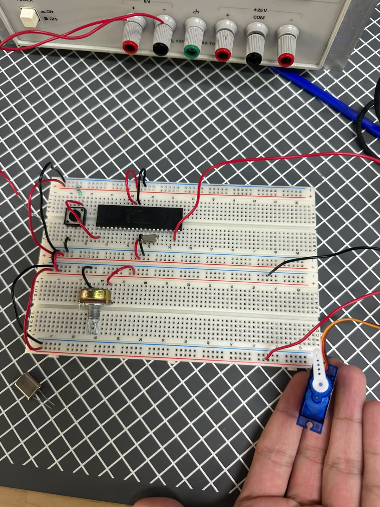
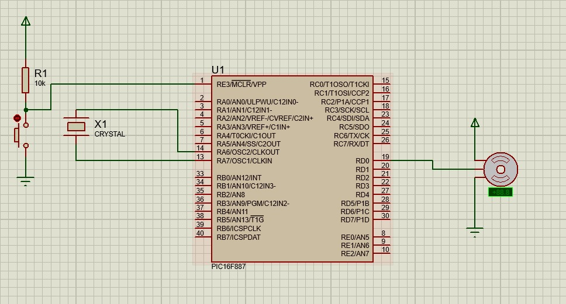

# Práctica 14 - Control de servomotores

## Objetivo

Implementar el control de posición angular de servomotores utilizando el microcontrolador PIC16F887. En la primera parte se desarrolló un movimiento automático que desplazaba el servomotor desde 0° hasta 180° y posteriormente regresaba a 0°. En la segunda parte se utilizó un potenciómetro para controlar de forma manual el ángulo de posición del servomotor.

---

## Material utilizado

- PIC16F887
- Servomotor
- Potenciómetro
- Protoboard
- Resistencias
- Cristal oscilador
- Fuente de alimentación
- Programador PIC
- Cables de conexión

---

## Circuito armado

A continuación se muestra el circuito implementado en protoboard y su simulación en Proteus.

 

 

*Figura 1. Circuito armado en protoboard.*

  

 

*Figura 2. Simulación del sistema en Proteus.*

 

---

## Desarrollo

### Control de posición mediante PWM

Para esta práctica se utilizó un servomotor controlado por el microcontrolador PIC16F887 mediante señales PWM. A diferencia de un motor DC convencional, un servomotor permite controlar directamente su posición angular mediante la variación del ancho de pulso de la señal de control.

La práctica se dividió en dos partes con el objetivo de comprender el funcionamiento de los servomotores y la generación de señales PWM para el posicionamiento angular.

### Parte 1: Movimiento automático de 0° a 180°

En la primera parte se programó el servomotor para realizar un recorrido automático desde la posición de 0° hasta 180°. Una vez alcanzado el ángulo máximo, el servomotor regresaba nuevamente a la posición inicial de 0°.

Este movimiento se ejecutaba de forma continua dentro de un ciclo repetitivo, permitiendo observar el comportamiento del servomotor y la relación existente entre el ancho de pulso de la señal PWM y la posición angular alcanzada.

Esta actividad permitió comprender la generación de señales PWM para el control de servomotores y la implementación de movimientos automáticos mediante programación.

### Parte 2: Control de posición mediante potenciómetro

En la segunda parte se utilizó un potenciómetro conectado a una entrada analógica del PIC16F887. El valor leído mediante el módulo ADC era convertido en un ángulo de posición para el servomotor.

Al girar el potenciómetro, el ángulo del servomotor cambiaba de manera proporcional, permitiendo controlar manualmente su posición dentro del rango de operación.

Esta actividad permitió integrar la conversión analógico-digital con el control PWM, logrando una interfaz de control sencilla y eficiente para posicionar el servomotor.

Mediante esta práctica se reforzaron conceptos relacionados con PWM, control de servomotores, lectura de entradas analógicas mediante ADC y conversión de señales analógicas a movimientos mecánicos utilizando el microcontrolador PIC16F887.

---

## Archivos de programación

### Parte 1 - Movimiento automático

📄 Archivo HEX utilizado para el recorrido automático de 0° a 180°:

- [Practica14_CicloServo.production.hex](Practica_14.X.production.hex)

### Parte 2 - Control mediante potenciómetro

📄 Archivo HEX utilizado para el control de posición mediante ADC:

- [Practica14_Potenciometro.production.hex](Practica_14_POT.X.production.hex)

---

## Resultados

Se logró controlar correctamente la posición angular del servomotor mediante señales PWM. En la primera parte se observó el movimiento automático entre 0° y 180°, mientras que en la segunda parte fue posible modificar la posición del servomotor de manera proporcional al movimiento del potenciómetro.

---

## Conclusiones

La práctica permitió comprender el funcionamiento de los servomotores y la relación entre el ancho de pulso de una señal PWM y la posición angular obtenida. Además, se reforzaron conocimientos relacionados con la generación de PWM, el uso del ADC y la integración entre sistemas electrónicos y elementos mecánicos utilizando el microcontrolador PIC16F887.
