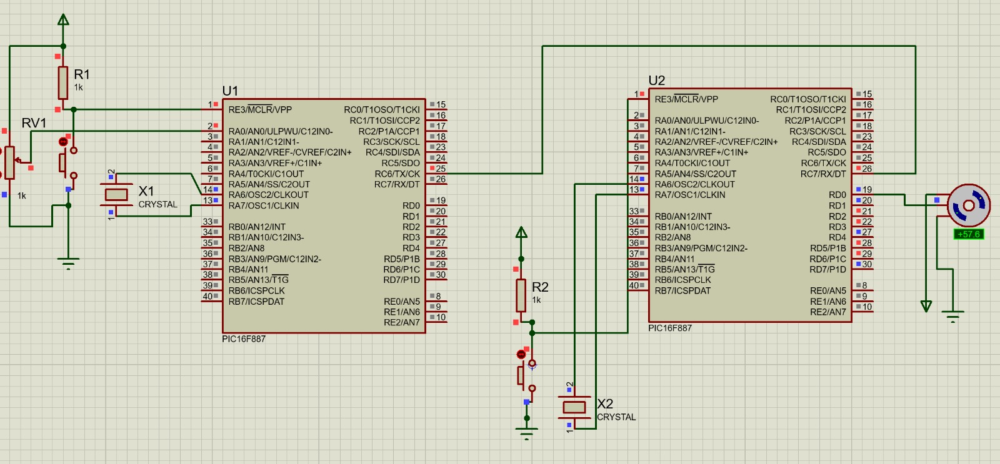

# Práctica 15 - Comunicaciones

## Objetivo

Implementar un protocolo de comunicación entre dos microcontroladores PIC16F887, permitiendo transmitir información desde un PIC maestro hacia un PIC esclavo para controlar la posición angular de un servomotor en tiempo real.

---

## Material utilizado

- 2 PIC16F887
- Servomotor
- Potenciómetro
- Protoboard
- Resistencias
- 2 Cristales osciladores
- Fuente de alimentación
- Programador PIC
- Cables de conexión

---

## Circuito armado

A continuación se muestra la simulación implementada en Proteus para la comunicación entre los dos microcontroladores y el control del servomotor.

 

 

*Figura 1. Simulación en Proteus.*

 

---

## Desarrollo

### Comunicación entre microcontroladores

La práctica consistió en implementar un sistema de comunicación entre dos microcontroladores PIC16F887. El primer microcontrolador funcionó como transmisor (maestro), mientras que el segundo operó como receptor (esclavo).

El objetivo principal fue enviar información relacionada con la posición deseada del servomotor desde el PIC transmisor hacia el PIC receptor mediante un protocolo de comunicación serial.

La implementación permitió comprender la forma en que distintos sistemas embebidos pueden intercambiar información para trabajar de manera coordinada dentro de una misma aplicación.

### Parte 1: Adquisición y transmisión de datos

En el microcontrolador transmisor se utilizó un potenciómetro conectado a una entrada analógica. El valor generado por el potenciómetro era convertido a formato digital mediante el módulo ADC del PIC16F887.

Posteriormente, esta información era procesada y enviada al segundo microcontrolador utilizando el protocolo de comunicación establecido entre ambos dispositivos.

Conforme se modificaba la posición del potenciómetro, los datos transmitidos cambiaban de manera proporcional, permitiendo actualizar continuamente la información enviada.

Esta etapa permitió integrar la conversión analógico-digital con la transmisión de datos entre sistemas embebidos.

### Parte 2: Recepción y control del servomotor

El segundo microcontrolador recibió la información enviada por el transmisor y la utilizó para generar la señal PWM necesaria para controlar la posición angular del servomotor.

Cada valor recibido correspondía a una posición específica dentro del rango de operación del servomotor. De esta forma, al modificar la posición del potenciómetro conectado al transmisor, el servomotor respondía actualizando su ángulo de manera proporcional.

Esta actividad permitió integrar comunicación serial, procesamiento de datos y control de actuadores dentro de un mismo sistema distribuido.

### Parte 3: Integración del sistema completo

Finalmente se integraron ambos microcontroladores para formar un sistema maestro-esclavo completamente funcional. El PIC transmisor se encargó de adquirir la información del usuario mediante el potenciómetro, mientras que el PIC receptor procesó los datos recibidos para controlar el servomotor.

La comunicación establecida permitió transmitir información de manera continua y confiable, logrando que el movimiento del servomotor reflejara correctamente los cambios realizados en el transmisor.

Mediante este proyecto se reforzaron conceptos relacionados con comunicación serial, conversión analógico-digital, generación de señales PWM, control de servomotores y diseño de sistemas embebidos distribuidos utilizando microcontroladores PIC16F887.

---

## Archivos de programación

### PIC Transmisor

📄 Archivo HEX utilizado para la adquisición y transmisión de datos:

- [PIC_Transmisor.production.hex](Practica15.X.production.hex)

### PIC Receptor

📄 Archivo HEX utilizado para la recepción de datos y control del servomotor:

- [PIC_Receptor.production.hex](Practica_15.X.production.hex)

---

## Resultados

Se logró establecer correctamente la comunicación entre dos microcontroladores PIC16F887, permitiendo transmitir información desde el sistema transmisor hacia el sistema receptor. El servomotor respondió adecuadamente a los datos recibidos, modificando su posición angular de forma proporcional a la variación realizada mediante el potenciómetro.

---

## Conclusiones

La práctica 15 permitió integrar múltiples temas abordados durante el curso, incluyendo conversión analógico-digital, comunicación serial, generación de señales PWM y control de servomotores. Además, se comprendió la importancia de los protocolos de comunicación en sistemas embebidos, demostrando cómo varios microcontroladores pueden trabajar de manera coordinada para realizar tareas de control y automatización.
