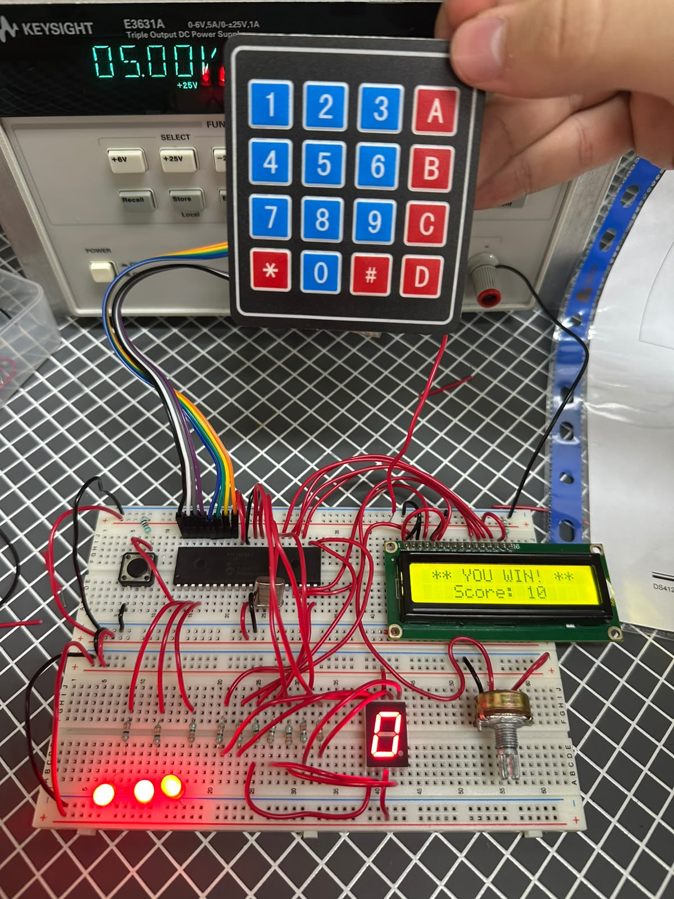
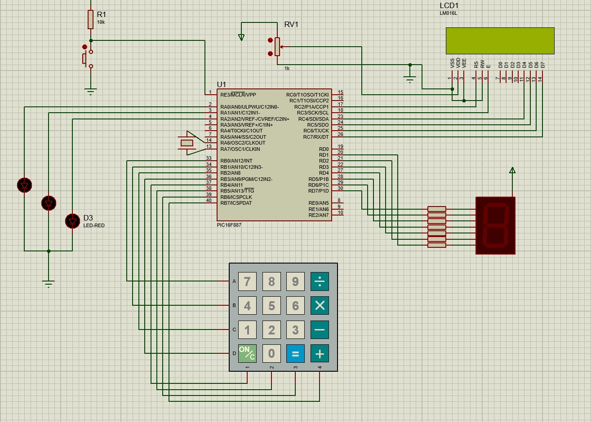

# Proyecto Final - Minijuego

## Objetivo

Desarrollar un videojuego interactivo utilizando el microcontrolador PIC16F887, integrando una pantalla LCD, un teclado matricial, un display de 7 segmentos y LEDs indicadores. El objetivo del juego es controlar una barra mediante el teclado para atrapar una gota que cae en la pantalla, acumulando puntos hasta ganar o perdiendo vidas cuando la gota no es atrapada.

---

## Material utilizado

- PIC16F887
- Pantalla LCD 16x2
- Teclado matricial 4x4
- Display de 7 segmentos
- 3 LEDs
- Pulsador de reinicio (Reset)
- Protoboard
- Resistencias
- Cristal oscilador
- Fuente de alimentación
- Programador PIC
- Cables de conexión

---

## Circuito armado

A continuación se muestra el circuito implementado en protoboard y su simulación en Proteus.

 

 

*Figura 1. Circuito armado en protoboard.*

  

 

*Figura 2. Simulación del sistema en Proteus.*

 

---

## Desarrollo

### Desarrollo del juego interactivo

El proyecto final consistió en desarrollar un videojuego utilizando el microcontrolador PIC16F887. Para ello se integraron diferentes periféricos vistos durante el curso, como la pantalla LCD, el teclado matricial, un display de 7 segmentos y LEDs indicadores, permitiendo crear una aplicación completamente interactiva.

El objetivo del juego era mover una barra ubicada en la parte inferior de la pantalla LCD para atrapar una gota que descendía desde la parte superior. Conforme el jugador atrapaba gotas, aumentaba su puntuación hasta completar la meta establecida para ganar la partida.

El proyecto se dividió en tres partes principales.

### Parte 1: Movimiento de la barra mediante teclado matricial

En la primera parte se programó el teclado matricial para controlar el movimiento de la barra mostrada en la pantalla LCD.

La tecla **4** permitía desplazar la barra hacia la izquierda, mientras que la tecla **6** la movía hacia la derecha. Cada vez que el usuario presionaba alguna de estas teclas, la posición de la barra se actualizaba en tiempo real, permitiendo colocarla debajo de la gota que descendía por la pantalla.

Esta actividad permitió integrar la lectura del teclado matricial con la actualización dinámica de gráficos en la pantalla LCD.

### Parte 2: Sistema de vidas y contador de puntos

En la segunda parte se implementó la lógica principal del juego. Cada vez que la barra lograba atrapar la gota, el contador de puntos aumentaba una unidad. Este conteo era mostrado mediante un display de 7 segmentos conectado al microcontrolador.

Por otra parte, cuando la barra no alcanzaba a atrapar la gota, el jugador perdía una vida. Las vidas disponibles eran representadas mediante tres LEDs encendidos.

Cada error ocasionaba que uno de los LEDs se apagara, permitiendo visualizar en todo momento la cantidad de vidas restantes durante la partida.

Esta actividad permitió integrar diferentes dispositivos de salida para representar simultáneamente el estado del juego.

### Parte 3: Condiciones de victoria y derrota

Finalmente se implementaron las condiciones de finalización del juego.

Si el jugador lograba atrapar diez gotas, el display alcanzaba el valor **10**, indicando que había ganado la partida. En ese momento el juego finalizaba mostrando un mensaje de victoria en la pantalla LCD.

En caso de que el jugador perdiera las tres vidas, los tres LEDs se apagaban completamente y la pantalla LCD mostraba un mensaje indicando que el jugador había perdido la partida.

Además, se incorporó un botón de **Reset**, el cual permitía reiniciar completamente el juego, restaurando las vidas, el contador de puntos y la posición inicial de todos los elementos para comenzar una nueva partida.

Mediante este proyecto se reforzaron conceptos relacionados con programación estructurada, manejo de teclado matricial, control de pantallas LCD, utilización de displays de 7 segmentos, manejo de LEDs, diseño de videojuegos básicos y desarrollo de sistemas interactivos utilizando el microcontrolador PIC16F887.

---

## Archivos de programación

### Programa principal

📄 Archivo HEX utilizado para el juego interactivo:

- [ProyectoFinal.production.hex](PF.X.production.hex)

---

## Resultados

Se logró desarrollar un juego completamente funcional utilizando el PIC16F887. El sistema permitió mover la barra mediante el teclado matricial, detectar correctamente cuándo la gota era atrapada, actualizar el contador de puntos mediante el display de 7 segmentos y controlar las vidas utilizando LEDs indicadores. Asimismo, se implementaron correctamente las condiciones de victoria, derrota y reinicio del juego.

---

## Conclusiones

El proyecto final permitió integrar la mayoría de los conocimientos adquiridos durante el curso en una sola aplicación. Se combinaron técnicas de manejo de entradas digitales, visualización en pantalla LCD, control de displays de 7 segmentos, utilización de LEDs indicadores y desarrollo de lógica de programación para crear un sistema interactivo. Además, se fortalecieron habilidades relacionadas con el diseño de aplicaciones embebidas utilizando el microcontrolador PIC16F887.
