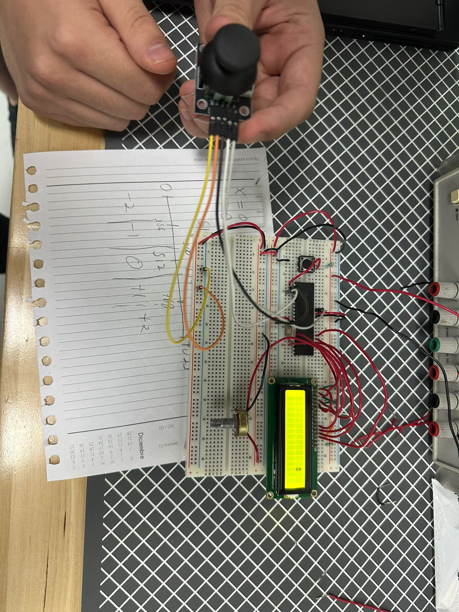
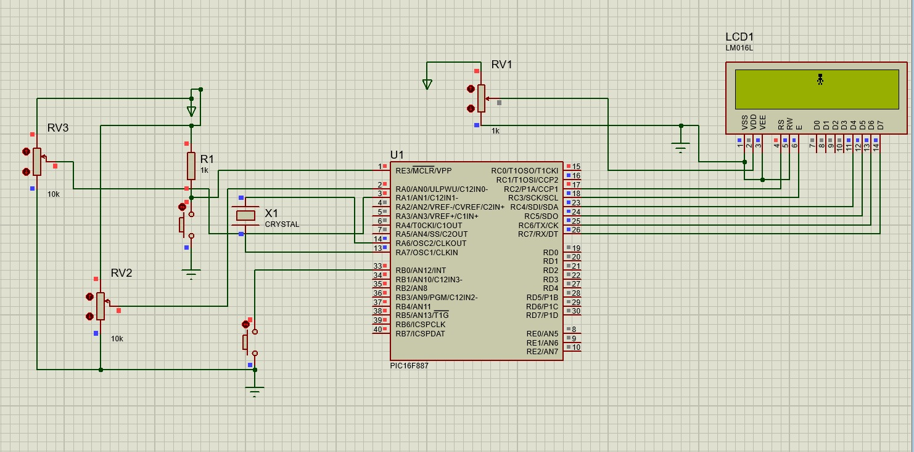

# Proyecto Unidad 1 - Animación en LCD controlada con Joystick

## Objetivo

Desarrollar una animación interactiva utilizando una pantalla LCD 16x2, un joystick y el microcontrolador PIC16F887, permitiendo mover un personaje en los ejes X y Y mediante el joystick y ejecutar una animación especial al presionar su botón integrado.

---

## Material utilizado

- PIC16F887
- Pantalla LCD 16x2
- Joystick analógico
- Protoboard
- Potenciómetro para contraste de LCD
- Pulsador integrado del joystick
- Cristal oscilador
- Resistencias
- Fuente de alimentación
- Programador PIC
- Cables de conexión

---

## Circuito armado

A continuación se muestra el circuito implementado en protoboard y su simulación en Proteus.

 

 

*Figura 1. Circuito armado en protoboard.*

  

 

*Figura 2. Simulación del proyecto en Proteus.*

 

---

## Desarrollo

### Control de animaciones mediante joystick

En este proyecto se utilizó una pantalla LCD 16x2 para desplegar una animación interactiva controlada mediante un joystick analógico. El sistema fue desarrollado utilizando el microcontrolador PIC16F887, aprovechando sus entradas analógicas para leer la posición del joystick y actualizar la ubicación de un personaje en la pantalla.

El joystick proporcionó dos señales analógicas correspondientes a los ejes X y Y, las cuales fueron convertidas a valores digitales mediante el módulo ADC del microcontrolador. Con base en estas lecturas, se determinó la dirección de movimiento del personaje dentro de la pantalla LCD.

### Parte 1: Movimiento en el eje X

En la primera etapa se programó el movimiento horizontal del personaje. Al desplazar el joystick hacia la izquierda o hacia la derecha, el personaje cambiaba su posición dentro de la pantalla LCD siguiendo la dirección indicada por el usuario.

Esta actividad permitió comprender la lectura de señales analógicas y la actualización dinámica de caracteres en la pantalla LCD.

### Parte 2: Movimiento en el eje Y

Posteriormente se incorporó el movimiento vertical utilizando la segunda salida analógica del joystick. De esta forma, el personaje podía desplazarse tanto entre filas como entre columnas, permitiendo un control bidimensional dentro de la pantalla.

Esta etapa permitió trabajar simultáneamente con múltiples entradas analógicas y coordinar el movimiento del personaje en ambos ejes.

### Parte 3: Animación mediante el botón del joystick

Finalmente se utilizó el pulsador integrado en el joystick para activar una animación especial. Al presionar el botón, el personaje ejecutaba una secuencia de movimiento previamente programada.

Para ello se utilizaron caracteres personalizados almacenados en la memoria CGRAM de la pantalla LCD, permitiendo generar figuras distintas a los caracteres estándar disponibles.

Esta función agregó interacción adicional al proyecto, permitiendo combinar movimiento y animación dentro de una misma aplicación.

Mediante este proyecto se reforzaron conceptos relacionados con el manejo de pantallas LCD, conversión analógico-digital, lectura de joysticks, generación de caracteres personalizados y desarrollo de interfaces interactivas utilizando el microcontrolador PIC16F887.

---

## Archivos de programación

### Programa principal

📄 Archivo HEX utilizado para el control del joystick y la animación:

- [ProyectoUnidad1.production.hex](Proyecto_Unidad_1.X.production.hex)

---

## Resultados

Se logró controlar correctamente el movimiento de un personaje dentro de la pantalla LCD utilizando un joystick analógico. El personaje respondió a los desplazamientos realizados en los ejes X y Y, mientras que el pulsador integrado permitió activar una animación especial utilizando caracteres personalizados.

---

## Conclusiones

El proyecto permitió integrar diferentes periféricos del PIC16F887 dentro de una aplicación interactiva. Se reforzaron conocimientos relacionados con la lectura de entradas analógicas mediante ADC, el control de pantallas LCD, la creación de caracteres personalizados y la programación de sistemas de interacción entre el usuario y el microcontrolador.
